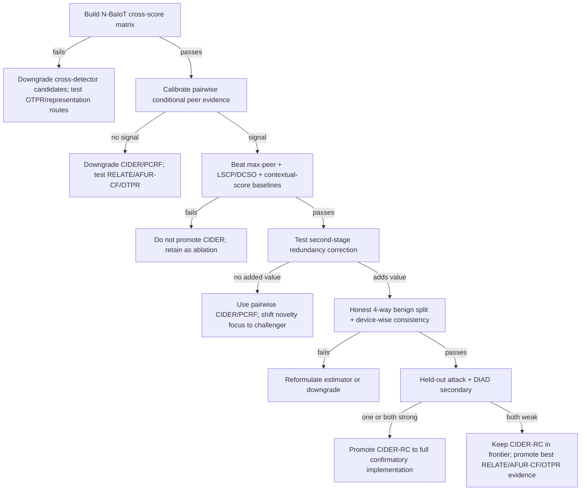
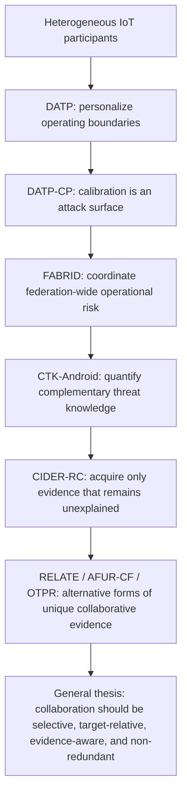

# Candidates — Updated Scientific Decision Report for the Next Journal-Grade Algorithm in Collaborative Federated IoT Malware Detection

**Status:** fully updated after adversarial novelty/feasibility audit through **30 September 2026**  
**Primary research target:** **CIDER-RC — Redundancy-Corrected Conditional Incremental Detection-Evidence Routing**  
**Serious independent challengers:** **RELATE**, **AFUR-CF**, **OTPR**  
**Security extension:** **Robust CIDER-RC**  
**Safe fallback / mandatory ablation:** **PCRF**

---

## 0. Purpose, evidence standard, and non-negotiable research rules

This document replaces the previous candidate report. It is not an addendum. Where the previous report named **CIDER** as the primary candidate, the primary method is now strengthened to **CIDER-RC**, because the literature audit shows that pairwise conditional anomaly scoring plus per-observation detector selection is still too close to existing contextual-anomaly and dynamic-ensemble work.

The central scientific question is now:

> **When another participant's detector sees the current observation, does it contribute threat evidence that remains genuinely new after conditioning on everything the target has already learned from its own detector and from previously accepted peers?**

This document follows six non-negotiable rules:

1. **Novelty must be mechanistic, not cosmetic.** A graph, attention layer, conformal wrapper, bandit, RL gate, Bayesian prior, prototype exchange, or new acronym does not create novelty by itself.
2. **Feasibility is mandatory.** Every promoted candidate must map its required variables to information actually available or defensibly derivable from the existing datasets.
3. **Positive results cannot be guaranteed.** The correct operational interpretation of the “positive-results” constraint is: a candidate is promoted only after a cheap, predeclared development POC shows a practically meaningful gain against strong trivial and literature-derived baselines. Confirmatory results must then be frozen and reported honestly even if negative.
4. **No outcome-driven redesign after confirmatory evaluation.** Method choices, thresholds, peer counts, estimators, and primary comparisons are frozen before multi-seed confirmation.
5. **No attack-label leakage into unsupervised candidates.** Attack labels may be used for development only in candidates whose definition explicitly requires them, such as AFUR-CF or OTPR. CIDER-RC remains benign-calibration driven.
6. **The paper must explain why each added computation exists.** Every module must survive an ablation and a trivial-baseline attack.

### Evidence qualification

The earlier report screened more than 100 contributions but correctly refused to claim that 100 were deeply inspected. This update contains a **56-paper individual mechanism-level audit**: for each included paper, the relevant mechanism, novelty threat, and required redesign/baseline are stated explicitly. This still does **not** mean every paper was read line-by-line from beginning to end. The strongest novelty claims remain provisional until a final candidate-specific full-text audit before submission.

---

## 1. Executive decision

### 1.1 Project-level decision

> **PIVOT THE SCIENTIFIC TARGET, PRESERVE THE INFRASTRUCTURE, AND CONSOLIDATE THE CANDIDATE FRONTIER.**

Do not restore FedCampaign-EMHI as the identity of the next journal paper. Preserve its conditional-residual intuition, experiment infrastructure, auditing discipline, negative results, and synthetic interaction-recovery machinery, but move the main question from higher-order coalition detection to **selective acquisition of unique collaborative evidence**.

The old pairwise CIDER formulation was:

\[
 e_{ij}(x)
 =-
 \log P_0\!\left(
 S_j\ge s_j(x)\mid S_i=s_i(x)
 \right).
\]

That remains a crucial first-stage score and ablation, but it is no longer the strongest final algorithm. The strengthened formulation conditions a candidate peer on both the target and the evidence already acquired from previously accepted peers:

\[
\boxed{
 e_{ij\mid A_t}(x)
 =-
 \log P_0\!\left(
 S_j\ge s_j(x)
 \mid
 S_i=s_i(x),\,S_{A_t}=s_{A_t}(x)
 \right)
}
\]

where \(A_t\) is the set of peers already admitted for this observation.

The algorithm therefore asks a stronger question:

> **Does peer \(j\) remain surprising after the information already available from the target and previously selected peers has been explained?**

This change is the most important scientific update in this document.

### 1.2 Updated frontier

| Priority | Candidate | Core scientific object | Feasibility | Novelty status | Decision |
|---:|---|---|---|---|---|
| **1** | **CIDER-RC** | Sequential target-conditioned and redundancy-corrected peer surprisal | **Very high** | **High, provisional** | **Primary** |
| **2** | **RELATE** | Relationship anomaly remaining after endpoint evidence is explained | High on CIC IoT-DIAD | **High if shortcut confounds are removed** | Independent challenger |
| **3** | **AFUR-CF** | Target-relative counterfactual attack-family utility | High on DIAD/CICIoT2023; moderate on N-BaIoT | Medium-high to high | Challenger |
| **4** | **OTPR** | Target-orthogonal threat prototypes | High | Medium-high | Challenger |
| **5** | **Robust CIDER-RC** | Bounded-influence incremental evidence under malicious/unreliable peers | Very high via simulation | High as extension | Security extension |
| — | **PCRF** | Static conditional peer fusion | **Very high** | Moderate | Fallback + mandatory ablation |

The previous 38-candidate inventory is retained below, but most entries are now explicitly reclassified as **components, estimators, ablations, comparators, or future extensions**, not standalone paper identities.

---

## 2. Current project reconstruction and what should survive

The strongest reusable scientific signal from the prior project is not the specific EMHI hierarchy. It is the observation that **conditional/purified residualization can separate information already explained by a target from information contributed by another source**.

The inherited project evidence should be treated as follows:

| Existing evidence | Interpretation for the new project |
|---|---|
| EMHI synthetic target-coordinate recovery was strong | Conditional/purified estimators can recover designed interaction structure; useful as a mechanism sanity check, not real-world efficacy proof |
| Corrected TON_IoT Full-vs-order-\(\le2\) advantage was effectively absent | Do not build the next paper around unavailable higher-order support |
| N-BaIoT peer shrinkage improved pooled ranking but harmed mean operating-point recall | Strong motivation for **selective** rather than indiscriminate peer pooling |
| Early CIC IoT-DIAD dyadic screen suggested a gain over endpoint-only scores | Worth repairing, but only with true identity, capture-disjoint evaluation, and shortcut removal; becomes RELATE |
| Experiment registry, preprocessing, checkpointing, material digests, temporal split infrastructure, paired inference, score/rank/fusion code | Reuse aggressively |
| Duplicate-identity and leakage audits already uncovered serious issues | Preserve the audit discipline as part of the scientific protocol |

**Important:** numerical values inherited from earlier status reports should be revalidated from the actual experiment artifacts before appearing in any manuscript. This document uses them only to guide research direction.

### 2.1 PhD-level coherence

The thesis story becomes:

- **DATP:** which participants need different decision boundaries?
- **DATP-CP:** can calibration/personalization itself be attacked?
- **FABRID:** how should federation-wide operational risk be allocated?
- **CTK-Android:** which peers possess complementary threat knowledge rather than merely more data?
- **CIDER-RC:** for this target and this observation, which peer contributes **new evidence not already explained by the target or the peers already consulted?**
- **RELATE / AFUR-CF / OTPR:** independent algorithmic routes that test the same broader thesis principle through relationship evidence, counterfactual threat utility, or knowledge representations.

The unifying theme is:

> **Selective collaborative intelligence under heterogeneous evidence.**

---

## 3. Data and information inventory

| Dataset | Defensible participant identity | Common feature view | Attack information | Genuine chronology | Best role |
|---|---:|---:|---:|---:|---|
| **N-BaIoT** | **Yes — 9 physical commercial IoT devices** | Yes | Mirai/BASHLITE attack types | Not required | **Primary CIDER-RC POC + confirmation** |
| **CIC IoT-DIAD 2024** | **Yes — device identity available in appropriate view** | Yes after controlled feature definition | 33 attacks / 7 categories | Capture structure available for higher-level holdout | **RELATE + strong CIDER-RC secondary** |
| **CICIoT2023** | Large IoT population; client mapping must be audited | Yes | 33 attacks / 7 categories | Dataset/capture semantics require audit | **AFUR-CF / OTPR / tertiary generalization** |
| TON_IoT | Source-IP grouping exists but physical-client interpretation is weak | Yes | Yes | Coverage semantics problematic | Negative control / robustness only |
| Edge-IIoTset | Real testbed; eligible peer population was small under prior parsing | Yes | Yes | Current chronology semantics weak | Secondary only if identity audit improves |
| Controlled generator | Fully defined | Fully defined | Fully defined | Simulated | Mechanism verification only |

### 3.1 Why N-BaIoT remains the primary CIDER-RC dataset

CIDER-RC needs only:

- real client identity;
- a shared detector input space;
- benign target-local data;
- one local detector per participant;
- peer scores on target observations;
- held-out benign data for final operating-point calibration.

It does **not** require timestamps, a pre-existing client graph, attack-family labels, production feedback, order-three interactions, or online rewards.

With only nine clients, exhaustive target-by-peer score caching is cheap enough that most candidate filtering can happen without repeated detector training.

---

## 4. Literature audit methodology

The audit searched adversarially for work that could invalidate each candidate rather than papers that merely support it. The relevant families are:

- personalized FL and collaboration geometry;
- graph/hypernetwork PFL;
- clustered and decentralized PFL;
- federated inference and inference-time ensembles;
- direct IoT/IIoT IDS and anomaly detection;
- conditional/contextual anomaly detection;
- dynamic outlier ensemble selection;
- score-dependency and copula fusion;
- prototype and knowledge-distillation FL;
- conformal prediction and risk control;
- Byzantine/poisoning robustness;
- drift, continual learning, and gossip collaboration;
- contextual-bandit and RL client selection;
- low-FPR unseen-attack detection.

The key novelty killers are now clear:

\[
\text{FedAMP/FedFomo/pFedCCG/FedAGHN}
\Rightarrow
\text{client-specific collaboration is not new}
\]

\[
\text{Federated Inference + 2026 edge collaboration}
\Rightarrow
\text{inference-time collaboration is not new}
\]

\[
\text{Conditional Anomaly Detection + QCAD}
\Rightarrow
\text{conditional anomaly scoring is not new}
\]

\[
\text{LSCP + DCSO + META-DES}
\Rightarrow
\text{per-observation expert selection is not new}
\]

\[
\text{FlowFuse + COPOD}
\Rightarrow
\text{dependency-aware score fusion is not new}
\]

\[
\text{G-PFL-ID/FedEP/FedRFF}
\Rightarrow
\text{graph/subspace/random-feature federated IoT anomaly learning is occupied}
\]

\[
\text{PROTEAN/FedProto/FedSA/FedPKD}
\Rightarrow
\text{prototype sharing itself is not new}
\]

\[
\text{GC-FCP/PFCP/Rob-FCP/CRC}
\Rightarrow
\text{federated/conformal risk calibration itself is not new}
\]

The remaining opportunity is therefore not a single familiar component. It is a **new information structure** that changes what collaboration means.

---

## 5. Individual 56-paper mechanism-level audit

The table below records the specific reason every included paper matters. “Threatens” means the paper weakens a possible novelty claim; it does not imply the methods are identical.

| # | Paper | Year / venue | Mechanism individually audited | Novelty claim it threatens | Required consequence for this project |

|---:|---|---|---|---|---|

| 1 | [Controlled Collaboration Geometry for Personalized Federated Learning](https://proceedings.mlr.press/v306/yin26j.html) | 2026 — ICML / PMLR | Collaboration matrices/graphs are explicit PFL objects; pFedCCG constrains collaboration geometry to prevent consensus or self-clustering. | Generic “learn who should collaborate” and graph-personalization claims. | CIDER-RC must use observation-specific unexplained evidence, not persistent graph geometry. |

| 2 | [Robust Federated Inference](https://proceedings.iclr.cc/paper_files/paper/2026/hash/b7988dbf1eb774d60fbe71e7d9d672c5-Abstract-Conference.html) | 2026 — ICLR | Formalizes adversarial robustness for inference-time aggregation of predictions from privately held models. | Any broad “robust collaborative inference” claim. | Robust CIDER-RC must focus narrowly on malicious manipulation of conditional peer evidence and bounded influence. |

| 3 | [Federated Inference: Toward Privacy-Preserving Collaborative and Incentivized Model Serving](https://arxiv.org/abs/2603.02214) | 2026 — arXiv / systems perspective | Treats independently trained models collaborating at inference time as a distinct paradigm. | Claim that post-training/federated inference itself is novel. | Frame CIDER-RC as a specific evidence-routing algorithm inside collaborative inference, without claiming the paradigm. |

| 4 | [G-PFL-ID: Graph-Driven Personalized Federated Learning for Unsupervised Intrusion Detection in Non-IID IoT Systems](https://doi.org/10.3390/iot7010013) | 2026 — IoT | Federated graph encoder + unsupervised DeepSVDD + local personalization for IoT IDS. | Personalized graph unsupervised IDS as a standalone identity. | Candidate #31 becomes a baseline/occupied direction. |

| 5 | [Efficient Personalized Federated PCA with Manifold Optimization for IoT Anomaly Detection (FedEP)](https://arxiv.org/abs/2602.12622) | 2026 — Preprint / IoT anomaly detection | Personalized robust/sparse federated PCA with manifold optimization. | Personalized FedPCA / subspace anomaly detection. | Candidate #27 becomes a baseline rather than a new paper identity. |

| 6 | [FedRFF: Enhanced Federated Random Fourier Feature Framework for IoT Anomaly Detection](https://icdcs2026.icdcs.org/program/main-technical-sessions/) | 2026 — IEEE ICDCS | Federated nonlinear random-feature anomaly representation for IoT. | Federated RFF / random-feature anomaly representation. | Candidate #28 is occupied; RFF can only be an alternative detector/representation. |

| 7 | [Federated Detection at the Edge: Collaborative Anomaly Detection for Resource-Limited IoT](https://doi.org/10.1109/JIOT.2026.3674644) | 2026 — IEEE Internet of Things Journal | Separates centralized training from lightweight collaborative edge inference; peers exchange predictions/trust signals. | Collaborative IoT anomaly inference itself. | CIDER-RC must contribute the sequential incremental-evidence object; also report edge cost. |

| 8 | [Multi-View Ensemble for Time Series Anomaly Detection via Coupling Flows (FlowFuse)](https://www.ijcai.org/proceedings/2026/332) | 2026 — IJCAI | Models joint dependencies among heterogeneous anomaly scores using coupling flows. | Generic dependency-aware anomaly-score fusion. | Flow/dependency fusion is a comparator; CIDER-RC must show benefit from cross-participant conditional innovation. |

| 9 | [Efficient Federated Conformal Prediction with Group-Conditional Guarantee](https://proceedings.mlr.press/v337/wen26a.html) | 2026 — UAI / PMLR | Federated group-conditional conformal calibration with mergeable group-stratified summaries. | Group/client-conditional federated conformal IDS. | Candidate #30 becomes a wrapper, not the core novelty. |

| 10 | [D-CAD: Decentralized Continual Anomaly Detection through Collaborative Knowledge Fusion in Wireless Sensor Networks](https://ph01.tci-thaijo.org/index.php/ecticit/article/view/266443) | 2026 — ECTI-CIT | Gossip-based continual anomaly learning with replay and dynamic peer weighting. | Continual gossip anomaly collaboration. | Candidate #29 and generic drift/gossip fusion lose standalone novelty. |

| 11 | [FedDriftGuard: Adaptive Federated Learning with Differential Privacy for Concept Drift in Edge Environments](https://doi.org/10.1038/s41598-026-51535-6) | 2026 — Scientific Reports | Combines concept-drift adaptation, FL, DP, and edge operation. | “Drift + FL + privacy” as novelty. | Drift should be a later stress condition, not the current algorithm identity. |

| 12 | [PROTEAN: Federated Intrusion Detection in Non-IID Environments through Prototype-Based Knowledge Sharing](https://arxiv.org/abs/2507.05524) | 2025 — ESORICS | Shares attack-class prototypes to transfer threat knowledge under non-IID IDS data. | Threat-prototype sharing and family-specific prototype transfer. | Raw prototype router becomes OTPR: only target-orthogonal knowledge should count. |

| 13 | [FedSA: A Unified Representation Learning via Semantic Anchors for Prototype-Based Federated Learning](https://ojs.aaai.org/index.php/AAAI/article/view/34464) | 2025 — AAAI | Uses semantic anchors/prototypes to align heterogeneous client representations and classifiers. | Prototype/anchor alignment as a generic FL contribution. | OTPR must be target-relative threat residualization, not simply better anchors. |

| 14 | [FedSPD: A Soft-clustering Approach for Personalized Decentralized Federated Learning](https://proceedings.mlr.press/v286/lin25a.html) | 2025 — UAI / PMLR | Soft-clustering in decentralized PFL with mixtures of data clusters and low-connectivity operation. | Generic decentralized clustering/personalization. | Candidate #33 becomes a baseline unless clustering state is threat-specific and novel. |

| 15 | [FedAGHN: Personalized Federated Learning with Attentive Graph HyperNetworks](https://doi.org/10.1016/j.knosys.2025.114355) | 2025 — Knowledge-Based Systems | Dynamically learns fine-grained client collaboration graphs via attentive graph hypernetworks. | Graph/attention/hypernetwork learning of collaborator relationships. | Candidates #31/#32 cannot rely on dynamic collaboration graphs as novelty. |

| 16 | [CO-PFL: Contribution-Oriented Personalized Federated Learning for Heterogeneous Networks](https://arxiv.org/abs/2510.20219) | 2025 — Preprint | Weights contributions using gradient-direction and prediction-deviation information with personalized submodels. | Generic client-contribution/reliability weighting. | PARIS-style weights alone are insufficient; reliability becomes a supporting CIDER-RC state. |

| 17 | [Personalized Federated Conformal Prediction with Localization](https://www.proceedings.com/085713-3400.html) | 2025 — NeurIPS | Localizes federated conformal calibration for personalized coverage. | Personalized/localized conformal gating. | Conformal peer gates are optional wrappers only. |

| 18 | [Contrastive Reinforcement Learning for Adaptive Client Selection in Federated Learning](https://doi.org/10.1016/j.procs.2025.07.137) | 2025 — Procedia Computer Science | Uses RL with contrastive state-action representations for adaptive client selection. | RL-based collaborator/client selection. | Candidate #16 cannot claim novelty from RL; no RL unless a real sequential reward problem emerges. |

| 19 | [FedMPD: Prototype-Based Knowledge Distillation for Multi-Modal Federated Learning](https://doi.org/10.1109/IMCEC66174.2025.11331860) | 2025 — IEEE IMCEC | Exchanges class/modality prototypes and performs prototype-based distillation. | Prototype + distillation knowledge transfer. | Candidate #23 and raw prototypes need a security-specific orthogonal-information object. |

| 20 | [Contextual Client Selection for Efficient Federated Learning over Edge Devices](https://doi.org/10.1109/TMC.2023.3323645) | 2024 — IEEE TMC | Neural contextual combinatorial bandit selects client combinations using client features and rewards. | Contextual-bandit peer/client selection. | Candidates #15/#34 require a new threat-specific state and real reward stream to survive. |

| 21 | [Certifiably Byzantine-Robust Federated Conformal Prediction](https://proceedings.mlr.press/v235/kang24c.html) | 2024 — ICML / PMLR | Provides conformal coverage bounds under Byzantine clients and robust calibration aggregation. | “Conformal + Byzantine robustness” novelty. | Robust CIDER-RC should not become another robust calibration paper. |

| 22 | [Federated Distillation: A Survey](https://arxiv.org/abs/2404.08564) | 2024 — Survey / arXiv | Systematizes federated knowledge distillation across heterogeneous models and communication settings. | Generic distillation as a novel collaboration mechanism. | Distillation becomes a transport mechanism/comparator, not the scientific contribution. |

| 23 | [Explainable Contextual Anomaly Detection using Quantile Regression Forests (QCAD)](https://doi.org/10.1007/s10618-023-00967-z) | 2023 — Data Mining and Knowledge Discovery | Models behavioral distributions conditional on contextual variables using conditional quantiles. | Conditional distribution/tail anomaly scoring. | CIDER-RC cannot claim conditioning; novelty must be sequential cross-participant innovation after already-acquired evidence. |

| 24 | [FedALA: Adaptive Local Aggregation for Personalized Federated Learning](https://ojs.aaai.org/index.php/AAAI/article/view/26330) | 2023 — AAAI | Adaptively aggregates global and local information toward each client objective. | Adaptive global/local mixing. | Global/local mixture candidates are saturated. |

| 25 | [FedPAC: Personalized Federated Learning with Feature Alignment and Classifier Collaboration](https://openreview.net/forum?id=SXZr8aDKia) | 2023 — ICLR | Aligns feature representations and performs client-specific classifier collaboration. | Feature-alignment plus classifier collaboration. | Sparse peer MoE / classifier collaboration must offer more than client-specific weighting. |

| 26 | [Federated Learning under Distributed Concept Drift](https://proceedings.mlr.press/v206/jothimurugesan23a.html) | 2023 — AISTATS / PMLR | Models distributed concept drift and adapts FL with evolving client clusters. | Drift-triggered client regrouping. | Candidate #14 cannot simply detect drift and switch collaborators. |

| 27 | [Federated Conformal Predictors for Distributed Uncertainty Quantification](https://proceedings.mlr.press/v202/lu23i.html) | 2023 — ICML / PMLR | Extends conformal prediction to heterogeneous federated data. | Federated calibration/UQ as standalone novelty. | Conformal methods belong in evaluation/risk wrappers, not the primary identity. |

| 28 | [A Prototype-Based Knowledge Distillation Framework for Heterogeneous Federated Learning (FedPKD)](https://doi.org/10.1109/ICDCS57875.2023.00091) | 2023 — IEEE ICDCS | Combines logits and prototypes for model-heterogeneous federated knowledge transfer. | Prototype-distillation transfer. | OTPR must transmit only target-unrepresented threat directions, not ordinary prototypes. |

| 29 | [FedProto: Federated Prototype Learning across Heterogeneous Clients](https://ojs.aaai.org/index.php/AAAI/article/view/20819) | 2022 — AAAI | Shares/aggregates class prototypes rather than gradients for heterogeneous FL. | Prototype sharing itself. | Candidates #5/#21 need target-relative novelty rather than another prototype exchange rule. |

| 30 | [FLAME: Taming Backdoors in Federated Learning](https://www.usenix.org/conference/usenixsecurity22/presentation/nguyen) | 2022 — USENIX Security | Combines clustering, clipping, and noise to suppress poisoned/backdoored updates. | Generic robust/trust aggregation in IDS. | Candidate #35 becomes a baseline; Robust CIDER-RC targets inference evidence rather than training updates. |

| 31 | [Ditto: Fair and Robust Federated Learning Through Personalization](https://proceedings.mlr.press/v139/li21h.html) | 2021 — ICML / PMLR | Regularizes each personalized model toward a shared global model. | Personalization as the core contribution. | Any new candidate must change collaboration information, not merely personalize the model. |

| 32 | [FedAMP: Federated Learning with Attentive Message Passing](https://ojs.aaai.org/index.php/AAAI/article/view/16960) | 2021 — AAAI | Uses pairwise model similarity and attentive message passing for personalized collaboration. | Pairwise client-specific collaboration. | CIDER-RC must base collaboration on observation-specific unexplained threat evidence. |

| 33 | [FedFomo: Federated Learning with Personalized Model Combination](https://openreview.net/forum?id=ehJqJQk9cw) | 2021 — ICLR | Clients estimate how much other client models improve their local objective and combine useful models. | “Select useful peers/models for each target” as a general idea. | AFUR-CF must use target-relative threat utility; CIDER-RC uses current-sample conditional innovation. |

| 34 | [Personalized Federated Learning using Hypernetworks (pFedHN)](https://proceedings.mlr.press/v139/shamsian21a.html) | 2021 — ICML / PMLR | Uses a hypernetwork to generate client-personalized model parameters. | Hypernetwork personalization. | Hypernetwork variants are implementation choices, not primary novelty. |

| 35 | [Oort: Efficient Federated Learning via Guided Participant Selection](https://www.usenix.org/conference/osdi21/presentation/lai) | 2021 — USENIX OSDI | Selects clients using statistical utility and system speed. | Utility-based FL participation scheduling. | Candidate #34 must not be another generic participation scheduler. |

| 36 | [FLTrust: Byzantine-Robust Federated Learning via Trust Bootstrapping](https://arxiv.org/abs/2012.13995) | 2021 — NDSS / arXiv | Uses a trusted server dataset to score client-update alignment. | Trust-weighted aggregation. | Generic trust scores do not create novelty; Robust CIDER-RC focuses on target-local benign evidence and inference outputs. |

| 37 | [Federated Optimization in Heterogeneous Networks (FedProx)](https://proceedings.mlsys.org/paper/2020/hash/1f5fe83998a09396ebe6477d9475ba0c-Abstract.html) | 2020 — MLSys | Adds a proximal local objective to stabilize FL under statistical/system heterogeneity. | Optimization-level heterogeneity handling. | Required baseline but unrelated to the new evidence-routing contribution. |

| 38 | [SCAFFOLD: Stochastic Controlled Averaging for Federated Learning](https://proceedings.mlr.press/v119/karimireddy20a.html) | 2020 — ICML / PMLR | Uses control variates to correct client drift. | Optimization drift correction. | Use only as an optimization baseline where relevant. |

| 39 | [Tackling the Objective Inconsistency Problem in Heterogeneous Federated Optimization (FedNova)](https://proceedings.neurips.cc/paper/2020/hash/564127c03caab942e503ee6f810f54fd-Abstract.html) | 2020 — NeurIPS | Normalizes heterogeneous local optimization progress. | Another aggregation/optimization heterogeneity method. | Prevents attributing optimizer differences to collaboration novelty. |

| 40 | [Personalized Federated Learning with Moreau Envelopes (pFedMe)](https://proceedings.neurips.cc/paper/2020/hash/f4f1f13c8289ac1b1ee0ff176b56fc60-Abstract.html) | 2020 — NeurIPS | Bilevel/Moreau-envelope formulation for personalized FL. | Regularized bilevel personalization. | No standalone Bayesian/regularized personalization candidate without a different scientific object. |

| 41 | [COPOD: Copula-Based Outlier Detection](https://arxiv.org/abs/2009.09463) | 2020 — IEEE ICDM | Uses empirical copula tail probabilities to detect multivariate outliers. | Copula/tail dependence as novelty. | Cross-client copulas can be an estimator/ablation only; not the candidate identity. |

| 42 | [FedGKT: Federated Learning for Heterogeneous Neural Networks via Group Knowledge Transfer](https://arxiv.org/abs/2007.14513) | 2020 — Preprint / federated distillation | Transfers knowledge between lightweight clients and a stronger server without identical architectures. | Heterogeneous model knowledge transfer/distillation. | Specialist/generalist distillation is crowded unless driven by a new threat-evidence rule. |

| 43 | [Power-of-Choice: Client Selection for Federated Learning with Biased Client Selection](https://arxiv.org/abs/2010.01243) | 2020 — Preprint / FL optimization | Studies deliberately biased utility-based client selection. | Generic utility-based participation selection. | Bandit/client-selection candidates need threat-specific mechanics beyond participation utility. |

| 44 | [LoPAD: Local Pattern-Based Anomaly Detection](https://pmc.ncbi.nlm.nih.gov/articles/PMC7206231/) | 2020 — Anomaly detection | Detects anomalies by violations of learned local/conditional dependency patterns. | Residual/dependency anomaly scoring alone. | RELATE and CIDER-RC must tie conditional residuals to cross-participant or relation-vs-endpoint evidence. |

| 45 | [LSCP: Locally Selective Combination in Parallel Outlier Ensembles](https://epubs.siam.org/doi/10.1137/1.9781611975673.66) | 2019 — SIAM SDM | Selects locally competent unsupervised outlier detectors for each query. | Sample-specific unsupervised detector selection. | Mandatory CIDER-RC baseline; routing alone is not novel. |

| 46 | [DCSO: Dynamic Combination of Detector Scores for Outlier Ensembles](https://arxiv.org/abs/1911.10418) | 2019 — Outlier ensemble | Dynamically combines/selects outlier detectors according to local competence. | Dynamic anomaly-detector combination. | Mandatory baseline; CIDER-RC must outperform competence-based selection. |

| 47 | [FedMD: Heterogeneous Federated Learning via Model Distillation](https://arxiv.org/abs/1910.03581) | 2019 — Preprint | Enables collaboration among heterogeneous local models through shared prediction/distillation information. | Heterogeneous model collaboration via knowledge distillation. | Distillation is a transport mechanism, not new algorithmic identity. |

| 48 | [The Hidden Vulnerability of Distributed Learning in Byzantium / Bulyan](https://proceedings.mlr.press/v80/mhamdi18a.html) | 2018 — ICML / PMLR | Analyzes weaknesses of Byzantine-resilient aggregation and proposes Bulyan. | Byzantine robust aggregation as a broad field. | Candidate #35 must not be another training-update aggregator. |

| 49 | [The Limitations of Federated Learning in Sybil Settings (FoolsGold)](https://arxiv.org/abs/1808.04866) | 2018/2020 — Security / FL poisoning | Uses similarity of client updates to downweight sybil attackers. | Reputation/similarity-based trust weighting. | PARIS/Robust CIDER-RC cannot rely on generic reputation or update similarity as novelty. |

| 50 | [Machine Learning with Adversaries: Byzantine Tolerant Gradient Descent (Krum)](https://proceedings.neurips.cc/paper/2017/hash/f4b9ec30ad9f68f89b29639786cb62ef-Abstract.html) | 2017 — NeurIPS | Introduces Krum-style Byzantine-resilient gradient selection. | Byzantine aggregation baseline family. | Generic trust aggregation candidate is saturated. |

| 51 | [META-DES: A Dynamic Ensemble Selection Framework using Meta-Learning](https://doi.org/10.1016/j.patcog.2014.12.003) | 2015 — Pattern Recognition | Predicts classifier competence for each query from meta-features. | Supervised per-query competence routing. | AFUR-CF must not reduce to cybersecurity-themed META-DES; its key object is target-relative counterfactual threat utility and held-out-family validation. |

| 52 | [Conditional Anomaly Detection](https://doi.org/10.1109/TKDE.2007.1009) | 2007 — IEEE TKDE | Formalizes anomalies that are unusual conditional on context rather than globally unusual. | Conditional anomaly detection as a general statistical idea. | CIDER-RC/RELATE claim cross-participant sequential evidence or relationship residuals, not conditional anomaly detection itself. |

| 53 | [Robust Aggregation for Federated Learning (RFA)](https://doi.org/10.1109/TSP.2022.3153135) | 2022 — IEEE Transactions on Signal Processing | Uses geometric-median-style robust aggregation and analyzes convergence. | Robust aggregation / geometric median. | Robust CIDER-RC operates on bounded inference evidence; RFA is a training-update baseline family. |

| 54 | [Federated Learning with Personalization Layers (FedPer)](https://arxiv.org/abs/1912.00818) | 2019 — Preprint | Splits globally shared representation layers from local personalized layers. | Shared/private parameter decomposition. | Personalized shared/private models are not a new main-paper identity. |

| 55 | [Conformal Risk Control](https://proceedings.iclr.cc/paper_files/paper/2024/hash/f3549ef9b5ff520a7e41ff3cc306ab2b-Abstract-Conference.html) | 2024 — ICLR | Extends conformal calibration from coverage to control of monotone expected losses. | Risk-valid decision gating/calibration as novelty. | Candidate #11 must be a supporting risk-control wrapper, not the core algorithm. |

| 56 | [Detecting Unseen IoT Attacks with Calibrated Dual Evidence Under Low False-Positive Budget](https://doi.org/10.3390/e28091026) | 2026 — Entropy | Combines supervised known-attack evidence with benign-deviation evidence, aligns them through benign-tail surprisal, and targets strict low FPR under family holdout. | Benign-tail surprisal + low-FPR unseen-attack fusion as a generic novelty claim. | CIDER-RC must emphasize cross-participant sequential innovation; evaluation must include strict TPR@1%/5% FPR and held-out attack tests. |

### 5.1 Literature-level conclusion

No single familiar ingredient remains defensible as the central novelty:

- not client similarity;
- not a collaboration graph;
- not inference-time collaboration;
- not conditional anomaly scoring;
- not dynamic detector selection;
- not score-dependency modeling;
- not prototypes;
- not federated conformal calibration;
- not trust-weighted aggregation;
- not contextual-bandit client selection;
- not drift adaptation.

The primary opportunity that survives is **sequential cross-participant innovation**:

\[
\boxed{
P_0\left(S_j\mid S_i,S_{A_t}\right)
}
\]

inside a procedure in which the conditioning set changes after each accepted peer. No equivalent mechanism was identified in the 56-paper audit, but this is still labeled **high provisional novelty**, not “first ever.”

---

## 6. Saturated directions and real remaining gaps

### 6.1 Directions that should not be main-paper identities

- another global/local personalized neural model;
- another client cluster;
- another client similarity graph;
- another GNN around clients;
- another attention-weighted peer aggregation method;
- another federated autoencoder IDS;
- another personalized federated PCA/subspace method;
- another random-feature federated anomaly representation;
- another prototype-sharing FL method;
- another KD-based federated expert system;
- another generic trust/reputation aggregation rule;
- another contextual-bandit or RL client selector;
- another conformal calibration paper applied to IDS;
- another generic continual/gossip anomaly detector;
- another global/local threshold optimization method.

### 6.2 Remaining methodological gaps

| Gap | Why existing work does not directly solve it | Candidate |
|---|---|---|
| **Sequential incremental peer evidence** | Existing conditional anomaly methods condition on context, and dynamic ensembles select experts, but do not explicitly remove evidence already explained by the target **and previously accepted peers** in a federated-participant interpretation | **CIDER-RC** |
| **Irreducible relationship evidence** | Endpoint scores can be ordinary while the source–destination relationship is malicious; generic contextual scoring does not by itself define the endpoint-vs-relation decomposition | **RELATE** |
| **Target-relative threat expertise** | A peer can be highly competent on a threat yet offer no incremental value to a target already competent on it | **AFUR-CF** |
| **Target-unrepresented threat knowledge** | Generic prototypes communicate what a class looks like, not the component that the target's current threat subspace cannot represent | **OTPR** |
| **Bounded inference-evidence robustness** | Training-update Byzantine defenses do not directly solve malicious inference-time peer score inflation/suppression inside conditional evidence routing | **Robust CIDER-RC** |

---

## 7. Updated candidate frontier

### 7.1 Planning-score rubric

Scores below are **scientific planning heuristics**, not empirical results. They should only determine discovery order.

\[
25\%\text{ novelty}
+25\%\text{ feasibility}
+20\%\text{ empirical plausibility}
+15\%\text{ journal strength}
+10\%\text{ PhD coherence}
+5\%\text{ runtime/practicality}.
\]

| Candidate | Novelty /25 | Feasibility /25 | Plausibility /20 | Journal /15 | PhD /10 | Runtime /5 | Total /100 | Role |
|---|---:|---:|---:|---:|---:|---:|---:|---|
| **CIDER-RC** | 23 | 23 | 16 | 14 | 10 | 4 | **90** | Primary |
| **RELATE** | 22 | 19 | 16 | 13 | 9 | 4 | **83** | Independent challenger |
| **AFUR-CF** | 20 | 20 | 16 | 13 | 10 | 3 | **82** | Challenger |
| **OTPR** | 19 | 21 | 16 | 12 | 10 | 4 | **82** | Challenger |
| **Robust CIDER-RC** | 20 | 22 | 15 | 12 | 9 | 3 | **81** | Security extension |
| **PCRF** | 14 | 24 | 16 | 10 | 9 | 5 | **78** | Fallback/ablation |

The most important distinction is that **CIDER-RC has the best combination of novelty and immediate testability**. RELATE may ultimately produce equally strong novelty, but its evidence quality depends on resolving capture, address, and identity confounds in CIC IoT-DIAD.

---

## 8. Full consolidation of the original 38 candidates

| # | Original candidate | Updated decision | Reason / exact new role |
|---:|---|---|---|
| 1 | CIDER | **UPGRADE → CIDER-RC** | Pairwise conditioning remains stage-1 evidence and ablation; final novelty is sequential redundancy correction |
| 2 | PCRF | **KEEP** | Essential static conditional-fusion fallback and CIDER-RC ablation |
| 3 | AFUR | **UPGRADE → AFUR-CF** | Replace generic competence with target-relative counterfactual threat utility |
| 4 | PARIS | **MERGE into Robust CIDER-RC** | Persistent reliability is useful state, but generic reliability weighting is too crowded |
| 5 | Threat-Prototype Router | **MERGE with #21 → OTPR** | Raw prototypes are occupied; use target-orthogonal threat information |
| 6 | True-Identity Dyadic Residual Detector | **MERGE with #20 → RELATE** | Stronger identity is endpoint-vs-relation residual evidence |
| 7 | Abstaining Collaborative Escalation | **MERGE into CIDER-RC acquisition rule** | Selective prediction alone is crowded; use abstention to decide whether peer acquisition is needed |
| 8 | Robust CIDER | **UPGRADE → Robust CIDER-RC** | Threat model becomes inference-evidence inflation/suppression under bounded leverage |
| 9 | Dual-Timescale Cooperation Graph | **DEFER / component** | Only meaningful with genuine temporal semantics; can become slow reliability state in Robust CIDER-RC |
| 10 | Mutual-Information Complementarity Graph | **ANALYSIS / pre-screening** | MI is useful for static peer pruning but not strong standalone novelty |
| 11 | Conformal Peer-Evidence Gate | **OPTIONAL WRAPPER** | FCP/GC-FCP/PFCP/CRC crowd the core idea; use only for formal risk control if justified |
| 12 | Sparse Personalized Peer MoE | **BASELINE / implementation alternative** | Generic MoE gating is crowded; CIDER evidence can be a gate but MoE is not the contribution |
| 13 | Hierarchical Bayesian Anomaly Manifold | **DEFER** | Only promote if the research question becomes small-sample partial pooling; otherwise too adjacent to Bayesian PFL |
| 14 | Drift-Triggered Collaboration Switching | **FUTURE** | Requires defensible chronology; drift-switching is already an established family |
| 15 | Contextual-Bandit Peer Selection | **FUTURE** | Needs a genuine sequential reward stream; contextual bandit client selection already exists |
| 16 | RL Peer Aggregator | **DROP as standalone** | Complexity without a unique scientific object; RL cannot be the novelty |
| 17 | Privacy-Noised Federated Inference Fusion | **FUTURE systems extension** | Privacy-preserving inference is separate from the current core mechanism |
| 18 | Disagreement-Driven Escalation Hierarchy | **MERGE into CIDER-RC** | Disagreement can trigger acquisition but is not a new main method |
| 19 | Cross-Client Score Copula | **ESTIMATOR / ABLATION** | COPOD/FlowFuse make dependency modeling crowded; copulas can estimate conditional laws |
| 20 | Relation-vs-Endpoint Factorization | **MERGE with #6 → RELATE** | Becomes an independent strong candidate |
| 21 | Family-Prototype Knowledge Transfer | **MERGE with #5 → OTPR** | Target-relative orthogonal threat prototypes are stronger than ordinary family prototypes |
| 22 | Gradient Threat-Direction Transfer | **LOW-PRIORITY extension** | If retained, transfer only target-orthogonal directions and audit gradient leakage |
| 23 | Specialist/Generalist Distillation Router | **BASELINE / transport mechanism** | Federated distillation is mature; use only if paired with a new evidence rule |
| 24 | Flow-Dependency Expert Fusion | **BASELINE** | FlowFuse is close; useful comparator against CIDER-RC |
| 25 | Federated One-Class MoE | **BASELINE / detector family** | Generic one-class MoE lacks a unique research object |
| 26 | Bayesian Shared/Private Normality Model | **ESTIMATOR option** | Could estimate CIDER conditional nulls in low-data regimes; not standalone |
| 27 | Personalized Sparse FedPCA IDS | **OCCUPIED / baseline** | FedEP directly occupies the main identity |
| 28 | Federated Random-Feature Anomaly Representation | **OCCUPIED / baseline** | FedRFF directly occupies the main identity |
| 29 | Continual Gossip Anomaly Collaboration | **OCCUPIED / future stronger variant only** | D-CAD occupies generic continual gossip anomaly fusion |
| 30 | Group-Conditional Federated Conformal IDS | **WRAPPER** | GC-FCP/PFCP and federated conformal literature occupy the core |
| 31 | Personalized Graph Unsupervised IDS | **OCCUPIED / baseline** | G-PFL-ID directly occupies the main identity |
| 32 | Attention-Based Peer PFL IDS | **OCCUPIED / baseline** | FedAMP/FedFomo/FedAGHN/pFedCCG make it incremental |
| 33 | Prediction-Based Client Grouping IDS | **BASELINE unless threat-specific** | FedSPD/IFCA-style clustering already covers generic grouping |
| 34 | Bandit Client Participation for IDS | **BASELINE / future systems** | Oort, Power-of-Choice and contextual-bandit selection occupy the generic mechanism |
| 35 | Byzantine Trust Aggregation IDS | **ROBUSTNESS BASELINE** | Krum/Bulyan/RFA/FLTrust/FoolsGold/FLAME saturate generic robust aggregation |
| 36 | Joint Detector/Threshold Adaptation | **SUPPORTING ABLATION ONLY** | Also risks overlap with DATP; not a new thesis layer |
| 37 | Adaptive Alert-Budget Router | **SUPPORTING POLICY / FABRID-adjacent** | Separate resource-allocation question, not next algorithm identity |
| 38 | Historical EMHI | **PRESERVE historically / synthetic mechanism only** | Real data currently do not exercise the defining higher-order mechanism |

---

# PART II — PRIMARY CANDIDATE

## 9. CIDER-RC — Redundancy-Corrected Conditional Incremental Detection-Evidence Routing

### 9.1 One-sentence identity

> **CIDER-RC learns the target-specific benign conditional response of each candidate peer, acquires the peer with the strongest reliable unexplained anomaly evidence, then reconditions all remaining peers on the evidence already acquired so that redundant peers are suppressed and only genuinely additional threat evidence is admitted.**

### 9.2 What is actually novel

Do **not** claim any of the following individually:

- conditional anomaly detection;
- peer collaboration;
- dynamic detector selection;
- dependency modeling;
- inference-time federated collaboration;
- anomaly-score fusion.

The defensible novelty target is the **sequential conditioning set**:

\[
\boxed{
\mathcal C_t(i,x)=\{S_i,S_{A_t}\}
}
\]

and the decision to acquire another participant only if that participant remains surprising under the benign law conditioned on \(\mathcal C_t\).

### 9.3 Problem formulation

There are \(K\) participating IoT clients. Client \(i\) owns benign training data

\[
B_i^{\mathrm{train}}=\{x_{in}\}_{n=1}^{N_i}
\]

and a local anomaly detector

\[
f_i:\mathcal X\rightarrow\mathbb R,
\qquad
s_i(x)=f_i(x).
\]

For target \(i\), peer \(j\)'s detector can evaluate the same target observation:

\[
s_{j\rightarrow i}(x)=f_j(x).
\]

Raw score averaging is unsafe because

\[
P_i(X\mid Y=0)\ne P_j(X\mid Y=0)
\]

and the peer score may be high simply because the target device differs from the peer's normal domain.

### 9.4 Stage 0 — local evidence

Convert the target local anomaly score into a target-benign tail evidence scale:

\[
a_i(x)
= -\log\left(
1-\widehat F_i^0(s_i(x))+\varepsilon
\right).
\]

This creates a comparable local evidence unit without making the threshold itself the methodological contribution.

### 9.5 Stage 1 — pairwise conditional peer evidence

Using only target-local benign conditional-model data \(B_i^R\), estimate

\[
F^0_{j\mid i}(v\mid u)
=
P_0(S_j\le v\mid S_i=u).
\]

Then

\[
p_{ij}(x)
=
1-\widehat F^0_{j\mid i}
\left(
 s_j(x)\mid s_i(x)
\right)
\]

and

\[
e_{ij}(x)
=
-\log(p_{ij}(x)+\varepsilon).
\]

This is the old CIDER object. It remains essential but is not the final novelty.

### 9.6 Stage 2 — redundancy correction

Assume peers \(A_t=\{j_1,\ldots,j_t\}\) have already been accepted for the current observation.

For every remaining peer \(j\notin A_t\), estimate the target-local benign law

\[
F^0_{j\mid i,A_t}
\left(
 v\mid u,z
\right)
=
P_0
\left(
S_j\le v
\mid
S_i=u,
S_{A_t}=z
\right).
\]

The redundancy-corrected tail probability is

\[
p_{ij\mid A_t}(x)
=
1-
\widehat F^0_{j\mid i,A_t}
\left(
 s_j(x)
 \mid
 s_i(x),
 s_{A_t}(x)
\right),
\]

and the redundancy-corrected evidence is

\[
\boxed{
e_{ij\mid A_t}(x)
=-\log(p_{ij\mid A_t}(x)+\varepsilon)
}.
\]

Interpretation:

- a redundant peer is strongly explained by the target and already selected peers, so its conditional tail returns toward ordinary benign values;
- a complementary peer remains unexpectedly high after conditioning and therefore contributes a new threat dimension.

### 9.7 Why the redundancy correction matters

Suppose two peers react to the same attack mechanism:

\[
S_{j_2}\approx g(S_i,S_{j_1})+\epsilon.
\]

Pairwise CIDER may produce

\[
e_{ij_1}\gg0,
\qquad
e_{ij_2}\gg0.
\]

After admitting \(j_1\), CIDER-RC evaluates

\[
e_{ij_2\mid\{j_1\}}
=-\log P_0
\left(
S_{j_2}\ge s_{j_2}(x)
\mid S_i,S_{j_1}
\right).
\]

If \(j_2\)'s reaction is already explained, the extra evidence collapses. If it catches a genuinely different malicious behavior, the evidence remains large.

This gives a reviewer-verifiable distinction from max-peer fusion and ordinary dynamic detector selection.

### 9.8 Conditional estimator choice

The final paper should **not** begin with neural conditional-density estimation.

Discovery order:

1. linear conditional mean residual — falsification only;
2. binned / isotonic conditional empirical tail;
3. quantile-regression forest or another calibrated low-dimensional conditional CDF;
4. optional copula estimator as an ablation;
5. only consider a neural conditional estimator if simpler estimators fail calibration for a demonstrated reason.

Because \(k_{\max}=2\) is preferred, the highest-dimensional conditional model in the first paper is only

\[
S_j\mid(S_i,S_{j_1}),
\]

which is feasible with classical estimators.

### 9.9 Cross-fitting and data splits

For each target device, use at least:

\[
B_i^{\mathrm{train}},
\quad
B_i^{R},
\quad
B_i^{C},
\quad
B_i^{\mathrm{test}}.
\]

- \(B_i^{\mathrm{train}}\): fit the local detector.
- \(B_i^{R}\): fit pairwise/sequential conditional benign laws; generate out-of-fold evidence by cross-fitting.
- \(B_i^{C}\): calibrate the final collaborative score to the required FPR.
- \(B_i^{\mathrm{test}}\): held-out benign test FPR.
- attack samples: held out from benign-only CIDER-RC fitting.

Do not reuse \(B_i^C\) to choose the conditional estimator after seeing test behavior.

### 9.10 Benign-only reliability

For each conditional state, estimate reliability from benign evidence only:

\[
\rho_{ij\mid A}
=
q\left(
 n_{ij\mid A},
 \mathrm{calibration\_error}_{ij\mid A},
 \mathrm{stability}_{ij\mid A}
\right)
\in[0,1].
\]

A simple first implementation is:

\[
\rho_{ij\mid A}
=
\exp(-\gamma E_{ij\mid A})
\min\left(1,\frac{n_{ij\mid A}}{n_{\min}}\right),
\]

where \(E_{ij\mid A}\) is an out-of-fold PIT/tail-calibration error.

Do not train a reliability neural network unless a later experiment proves the simple form inadequate.

### 9.11 Acquisition utility

Bound a peer's contribution:

\[
\widetilde e_{ij\mid A}(x)
=
\min(e_{ij\mid A}(x),e_{\max}).
\]

Define

\[
u_{ij\mid A}(x)
=
\rho_{ij\mid A}\widetilde e_{ij\mid A}(x).
\]

At acquisition step \(t\):

\[
j_t^*
=
\arg\max_{j\notin A_t}u_{ij\mid A_t}(x).
\]

Admit \(j_t^*\) only if

\[
u_{ij_t^*\mid A_t}(x)>\eta_{i,t},
\]

where \(\eta_{i,t}\) is fixed on benign development/calibration data.

### 9.12 Abstention / no-collaboration behavior

CIDER-RC must be allowed to say:

> **No peer adds enough reliable new evidence.**

If no peer crosses the acquisition gate, the system falls back to the target-local score.

This turns the earlier “Abstaining Collaborative Escalation” candidate into a scientifically meaningful part of CIDER-RC rather than a separate paper.

### 9.13 Minimal final score

Use additive non-negative peer evidence:

\[
\boxed{
H_i(x)
=
a_i(x)
+
\lambda
\sum_{t=1}^{k_i(x)}
\left[
u_{ij_t^*\mid A_{t-1}}(x)-\eta_{i,t}\right]_+
}
\]

with

\[
k_i(x)\le k_{\max},
\qquad
k_{\max}\in\{1,2\}
\]

for the first paper.

### 9.14 Monotone safety property

Because peer terms are non-negative,

\[
\boxed{H_i(x)\ge a_i(x)}.
\]

A score-suppressing malicious peer therefore cannot make the collaborative score *less anomalous* than the local detector, provided the local term is always retained.

This is not a full Byzantine guarantee, but it is a useful structural safety property.

### 9.15 Bounded peer influence

Because

\[
\widetilde e_{ij\mid A}(x)\le e_{\max},
\]

and at most \(k_{\max}\) peers are admitted,

\[
0\le H_i(x)-a_i(x)
\le
\lambda k_{\max}e_{\max}
\]

(up to the acquisition offsets).

This bounds the maximum direct inflation attributable to admitted peers and motivates the Robust CIDER-RC extension.

### 9.16 Final operating-point calibration

On independent benign calibration data:

\[
T_i(\alpha)
=
Q_{1-\alpha}
\left(
\{H_i(b):b\in B_i^C\}
\right).
\]

Prediction:

\[
\widehat y_i(x)=\mathbf1[H_i(x)>T_i(\alpha)].
\]

This threshold is **not the contribution**. Every baseline receives an equally honest target-specific held-out operating-point calibration.

### 9.17 Pseudocode

```text
INPUT
    local detectors f_1 ... f_K
    target i
    benign splits B_i^R and B_i^C
    candidate peers P_i
    maximum acquisitions k_max (start with 2)
    target FPR alpha

FIT PAIRWISE CONDITIONAL NULLS
    for each peer j in P_i:
        evaluate f_i and f_j on B_i^R
        cross-fit F0_{j|i}
        compute out-of-fold conditional tail evidence
        estimate rho_{ij}

OPTIONAL SECOND-STAGE NULLS
    for candidate first peers j1:
        for each remaining peer j2:
            cross-fit F0_{j2|i,j1}
            estimate rho_{ij2|j1}

DEFINE SCORE H_i(x)
    local_evidence = a_i(x)
    A = empty set
    collaborative_increment = 0

    repeat until |A| == k_max:
        for each j not in A:
            p = conditional_upper_tail(
                peer_score=s_j(x),
                context=[s_i(x), scores of peers in A],
                fitted_null=F0_{j|i,A}
            )
            e = min(-log(p + epsilon), e_max)
            u_j = rho_{ij|A} * e

        j_star = argmax_j u_j
        if u_{j_star} <= acquisition_gate(i, |A|):
            break

        collaborative_increment += max(0, u_{j_star} - gate)
        A = A union {j_star}

    return local_evidence + lambda * collaborative_increment

FINAL CALIBRATION
    evaluate fixed H_i on independent B_i^C
    set T_i(alpha) to benign (1-alpha)-quantile

INFERENCE
    alert iff H_i(x) > T_i(alpha)

OUTPUT
    local evidence
    final collaborative score
    admitted peer sequence
    incremental evidence at each acquisition
    alert / no alert
```

### 9.18 Complexity

With \(K\) total clients and target-specific static pre-screened set \(K_i'\):

- detector cross-scoring: \(O(K_i'N_i)\) per target for score caching;
- pairwise conditional fits: \(O(K_i')\) low-dimensional models;
- second-step conditional fits: up to \(O(K_i'^2)\), still trivial for nine N-BaIoT clients;
- inference: up to \(K_i'\) peer detector evaluations unless static pruning or staged evaluation is used;
- routing state is small compared with detector parameters.

For N-BaIoT discovery, exhaustive evaluation is preferable because premature optimization can hide the mechanism.

### 9.19 Main failure modes

1. **Cross-device incompatibility:** a peer may simply be a poor detector on another device domain.
2. **Trivial max-peer explanation:** normalized max score may explain the gain.
3. **Dynamic-selection equivalence:** LSCP/DCSO may perform the same.
4. **Pairwise CIDER sufficiency:** redundancy correction may add no measurable benefit.
5. **Conditional estimator instability:** second-stage conditional tails may be poorly calibrated at small sample sizes.
6. **One-device dominance:** pooled gains may be driven by one camera/doorbell.
7. **Benign contamination:** calibration attacks may distort evidence.
8. **Malicious peer inflation:** extreme scores may manufacture surprisal.
9. **Model-transfer/privacy architecture:** executing peer models locally exposes models; remote queries may expose target features.

Every failure mode has a predeclared test below.

### 9.20 CIDER-RC novelty statement to target

> **CIDER-RC is a collaborative anomaly-detection algorithm that sequentially acquires peer evidence using a target-specific benign conditional response law. After each peer is acquired, remaining peers are rescored conditional on both the target and the already acquired peer responses, so collaboration is driven by evidence that remains statistically unexplained rather than by model similarity, persistent client utility, local-region detector competence, or raw anomaly magnitude.**

Do not claim “first conditional anomaly detector,” “first dynamic ensemble,” “first personalized collaboration graph,” or “first federated inference method.”

---

# PART III — INDEPENDENT CHALLENGERS

## 10. RELATE — Relation-vs-Endpoint Conditional Evidence Detection

### 10.1 Scientific question

> **Is a source–destination/device relationship itself anomalous after explaining how anomalous the two endpoints already look individually?**

This combines and strengthens the old “True-Identity Dyadic Residual Detector” and “Relation-vs-Endpoint Factorization” candidates.

### 10.2 Core decomposition

Let endpoint evidence be

\[
S_u(x),\qquad S_v(x),
\]

and relationship evidence be

\[
S_{uv}(x).
\]

Estimate on benign traffic:

\[
F^0_{uv}
(r\mid s_u,s_v)
=
P_0(S_{uv}\le r\mid S_u=s_u,S_v=s_v).
\]

Then

\[
\boxed{
e^{\mathrm{rel}}_{uv}(x)
=
-\log
P_0\left(
S_{uv}\ge s_{uv}(x)
\mid
S_u(x),S_v(x)
\right)
}.
\]

The desired decomposition is:

\[
\text{total evidence}
=
\text{endpoint evidence}
+
\text{irreducible relationship evidence}.
\]

### 10.3 Why this is scientifically distinct

A malicious relation can be abnormal even when neither endpoint is globally abnormal. Conversely, an endpoint may be abnormal while its relationship pattern is ordinary. The residual relationship term explicitly separates these cases.

### 10.4 Primary feasibility target

**CIC IoT-DIAD** is the strongest current dataset because it exposes real device-identification and traffic relationships and includes many attacks. However RELATE is only publishable if it survives:

- true device identity;
- capture-disjoint train/calibration/test;
- removal of direct device/IP/MAC shortcut features where they would trivialize identity;
- row-sampling leakage audit;
- endpoint-only baseline;
- relation-only baseline;
- unconditional dyad score;
- conditional relation evidence;
- second dataset or held-out capture replication.

### 10.5 Decisive falsification

RELATE fails as a paper identity if the gain disappears after address/device shortcuts and same-capture leakage are removed.

### 10.6 Novelty claim

Do not claim conditional anomaly scoring. Claim the explicit **endpoint-vs-relationship evidence decomposition** under a real device identity and leakage-controlled evaluation.

---

## 11. AFUR-CF — Counterfactual Attack-Family Utility Routing

### 11.1 Scientific question

> **Which peer has threat expertise that adds value specifically where the target is weak, rather than merely being a globally strong detector?**

### 11.2 Target-relative counterfactual utility

For target \(i\), peer \(j\), and development attack type/family \(c\), define

\[
\boxed{
G_{ijc}
=
\mathrm{TPR}_{j\rightarrow i,c}@\alpha
-
\mathrm{TPR}_{i,c}@\alpha
}.
\]

This is intentionally different from peer accuracy.

A peer with excellent overall detection can have

\[
G_{ijc}\approx0
\]

if the target already detects family \(c\) well.

Build the competence vector

\[
\mathbf g_{ij}
=(G_{ij1},\ldots,G_{ijC}).
\]

### 11.3 Online routing challenge

The router cannot observe the true attack family at test time. It must derive a frozen threat-phenotype representation \(q_i(x)\) without using the test label and route according to

\[
j^*
=
\arg\max_j q_i(x)^\top\mathbf g_{ij}.
\]

### 11.4 Strongest scientific test

The mandatory test is **leave-one-attack-type/family-out development**:

1. remove family \(c^*\) from utility-map construction and router development;
2. freeze \(\mathbf g\), \(q_i\), hyperparameters, and peer set;
3. evaluate on \(c^*\);
4. compare against non-routed ensembles, META-DES-like competence routing, LSCP/DCSO-style selection, and best persistent peer.

AFUR-CF only becomes strong if the routing rule transfers to held-out threat types.

### 11.5 Dataset recommendation

- N-BaIoT: cheap POC, but only ten attack subtypes from two botnet families; do not call this broad unseen-family generalization.
- CIC IoT-DIAD / CICIoT2023: stronger eventual environment because the attack taxonomy is broader.

### 11.6 Main novelty risk

If \(q_i(x)\) is simply a supervised meta-classifier predicting family/competence, AFUR-CF can collapse into META-DES/MoE. The counterfactual target-relative utility must materially matter in ablation.

---

## 12. OTPR — Orthogonal Threat-Prototype Routing

### 12.1 Scientific question

> **Can a peer transfer only the part of its threat representation that the target does not already know?**

### 12.2 Why ordinary prototypes are insufficient

FedProto, FedSA, FedPKD, FedMPD and especially PROTEAN make ordinary class/family prototypes too crowded for a new paper identity.

### 12.3 Target-orthogonal threat prototype

Let \(p_{jc}\) be peer \(j\)'s prototype for threat class/family \(c\). Let \(U_i\) span the target's already represented threat subspace. Define

\[
\boxed{
\widetilde p_{jc}^{(i)}
=
(I-U_iU_i^\top)p_{jc}
}.
\]

Only the residual component orthogonal to the target's known threat space is transferred/routed.

The target scores a representation \(z_i(x)\) against

\[
\widetilde p_{jc}^{(i)}
\]

rather than the raw prototype.

### 12.4 Strong ablations

- raw prototype transfer;
- aggregated global prototype;
- PROTEAN-like family prototype sharing;
- target-orthogonal prototype;
- random orthogonal directions;
- remove target threat subspace;
- leave-one-family-out transfer.

### 12.5 Feasibility caveat

OTPR requires labeled attack examples during development. It is therefore a different scientific regime from benign-only CIDER-RC and must not be mixed into CIDER-RC's primary claim.

---

# PART IV — SECURITY EXTENSION AND FALLBACK

## 13. Robust CIDER-RC

### 13.1 Threat model

A compromised peer may:

- inflate its anomaly score to manufacture extreme incremental evidence;
- suppress its score to avoid contributing;
- return stochastic inconsistent outputs;
- collude with another peer;
- drop out.

### 13.2 Core design principles

1. retain the local target evidence in all cases;
2. admit only positive peer increments;
3. clip peer evidence by \(e_{\max}\);
4. cap the number of admitted peers;
5. estimate reliability from benign conditional calibration/stability;
6. fall back to local-only scoring if peers are unsupported or unreliable;
7. test manipulation at the **inference-evidence** level rather than pretending to solve all Byzantine FL.

### 13.3 Useful safety bounds

Local non-degradation structurally:

\[
H_i(x)\ge a_i(x).
\]

Maximum direct collaborative uplift:

\[
H_i(x)-a_i(x)
\le
\lambda k_{\max}e_{\max}.
\]

These are bounded-influence properties, not full adversarial certification.

### 13.4 Robustness experiments

- constant score inflation;
- monotonic inflation;
- score suppression;
- selective attack-only inflation;
- benign-only inflation to poison final FPR;
- random noise;
- peer dropout;
- two-peer collusion;
- reliability on/off;
- clipping on/off;
- local fallback on/off.

---

## 14. PCRF — Pairwise Conditional Residual Fusion

PCRF remains the deliberately simpler fallback:

\[
H_i^{\mathrm{PCRF}}(x)
=
a_i(x)
+
\lambda\operatorname{median}_{j\in J_i}e_{ij}(x).
\]

Strengths:

- no sequential routing;
- no attack labels;
- no temporal assumptions;
- no graph;
- no online reward;
- easy to implement and audit;
- very low failure risk.

Weakness:

- contextual anomaly detection + anomaly-ensemble literature makes the mechanism less novel.

PCRF becomes standalone only if the conditional transformation yields a large and consistent operating-point benefit that cannot be reproduced by unconditional normalized ensembles or dynamic detector selection.

---

# PART V — FEASIBILITY AND DISCOVERY PROGRAM

## 15. Candidate feasibility matrix

| Candidate | Required information | Actual source | Status | Main risk |
|---|---|---|---|---|
| CIDER-RC | true clients | N-BaIoT physical device IDs | **Direct** | none |
| CIDER-RC | shared detector feature space | N-BaIoT features | **Direct** | normalization consistency |
| CIDER-RC | benign target calibration | benign per-device samples | **Direct** | honest splitting |
| CIDER-RC | peer scores on target samples | cached model inference | **Derivable** | compute only |
| CIDER-RC | pairwise conditional nulls | target benign cross-scores | **Derivable** | calibration quality |
| CIDER-RC | second-stage conditional nulls | target + first-peer benign cross-scores | **Derivable** | sample support; keep \(k_{\max}=2\) |
| RELATE | true endpoints/devices | CIC IoT-DIAD | **Direct in appropriate view** | shortcut/capture confounding |
| RELATE | relationship features | packet/flow relation | **Direct/derivable** | feature leakage |
| AFUR-CF | attack type/family labels | N-BaIoT / DIAD / CICIoT2023 | **Direct** | development leakage |
| AFUR-CF | target-relative utility matrix | cross-score experiments | **Derivable** | sparse family-target cells |
| OTPR | labeled threat examples | datasets above | **Direct** | supervised assumption |
| OTPR | target threat subspace | target labeled development attacks | **Derivable** | subspace stability |
| Robust CIDER-RC | malicious score behaviors | simulation | **Defensibly simulatable** | scope of threat model |
| PCRF | same pairwise score matrix as CIDER | N-BaIoT | **Direct/derivable** | novelty only |

---

## 16. Updated POC catalog

The POCs are deliberately ordered from cheapest and most decisive to more expensive. Cached score matrices should be reused aggressively.

| ID | Candidate | Procedure | Primary comparison / metric | Promotion criterion |
|---|---|---|---|---|
| P01 | CIDER family | Build full N-BaIoT target × detector cross-score matrix | finite scores, latency | all target-peer pairs usable |
| P02 | CIDER | Pairwise benign score correlation/dependence | Pearson/Spearman + rank dependence | enough non-perfect dependence to justify conditioning |
| P03 | CIDER | Fit linear residual diagnostic | benign residual calibration | stable enough for falsification only |
| P04 | CIDER | Fit held-out conditional CDF/tail \(S_j\mid S_i\) | PIT/calibration error | calibrated for most pairs |
| P05 | CIDER | Attack-vs-benign pairwise surprisal separation | AUROC exploratory; TPR@FPR decisive | positive signal in >=6/9 devices preferred |
| P06 | CIDER | Pairwise CIDER vs target-only | TPR@1%,5% FPR | positive mean + no broad regressions |
| P07 | CIDER | Pairwise CIDER vs max peer percentile | TPR@FPR | >=2 pp mean gain or material worst-device gain |
| P08 | CIDER | Pairwise CIDER vs mean/median normalized peer | TPR@FPR | conditional evidence adds value |
| P09 | CIDER | Pairwise CIDER vs LSCP-style selection | TPR@FPR | must beat or clearly improve worst-client behavior |
| P10 | CIDER | Pairwise CIDER vs DCSO-style selection | TPR@FPR | same |
| P11 | CIDER | Pairwise CIDER vs QCAD-style contextual score | TPR@FPR + calibration | cross-participant formulation must matter |
| P12 | CIDER | Pairwise CIDER vs FlowFuse/dependency baseline where reproducible | TPR@FPR | not explained by generic dependence fusion |
| **P13** | **CIDER-RC** | Fit \(S_{j_2}\mid(S_i,S_{j_1})\) on target benign | second-stage PIT/calibration | stable enough for top first-peer states |
| **P14** | **CIDER-RC** | Pairwise CIDER vs redundancy-corrected second-peer evidence | TPR@FPR | **RC must add measurable value or simplify back to pairwise** |
| P15 | CIDER-RC | Top-1 vs sequential top-2 | detection gain / compute | top-2 only retained if it materially helps |
| P16 | CIDER-RC | Random second peer vs RC-selected second peer | TPR@FPR | RC selection must win |
| P17 | CIDER-RC | Shuffle first-peer identity before second-stage conditioning | TPR@FPR / calibration | benefit should degrade |
| P18 | CIDER-RC | Remove first-peer score from second-stage conditional law | TPR@FPR | proves redundancy correction contributes |
| P19 | CIDER-RC | Conditional estimator: isotonic/binning vs QRF vs copula | calibration + TPR | simplest calibrated estimator wins |
| P20 | CIDER-RC | 500 / 2k / 10k benign conditional samples | calibration + TPR | useful at practical sizes |
| P21 | CIDER-RC | honest 4-way benign splitting | test FPR + TPR | gain survives no-reuse protocol |
| P22 | CIDER-RC | out-of-fold vs in-sample evidence | calibration | confirmatory keeps cross-fitting |
| P23 | CIDER-RC | device-wise effect forest plot | signed delta TPR | preferred >=6/9 directional improvement |
| P24 | CIDER-RC | attack-type stratification | TPR by subtype | gain not from one subtype only |
| P25 | CIDER-RC | leave-one-attack-type-out evaluation | held-out-type TPR | directional gain preferred |
| P26 | CIDER-RC | static benign-only peer pruning | gain vs peer count | top 2–3 candidate pool retains most benefit |
| P27 | CIDER-RC | monotonic transforms of peer scores | decision stability | rank/tail variant reasonably stable |
| P28 | CIDER-RC | AE vs PCA/Mahalanobis local detectors | effect consistency | mechanism should not require one AE architecture |
| P29 | CIDER-RC | pooled AE and FedAvg/FedProx comparisons | TPR@FPR | evidence routing must remain useful |
| P30 | CIDER-RC | reproduce old peer-shrinkage baseline | same FPR | selective method should resolve shrinkage failure |
| P31 | CIDER-RC | 1% / 5% benign contamination of conditional-calibration data | FPR + TPR degradation | graceful degradation |
| P32 | Robust CIDER-RC | score inflation/suppression attacks | worst damage vs local-only | clipping/fallback limits harm |
| P33 | Robust CIDER-RC | two-peer collusion | FPR/TPR | bounded damage; local baseline retained |
| P34 | CIDER-RC | peer dropout | TPR/FPR | graceful fallback |
| P35 | CIDER-RC | complexity benchmark | latency, memory, bytes, models/sample | practical with pruned pool/top-2 |
| P36 | RELATE | rebuild dyad experiment with true device IDs | TPR/AUROC | initial effect survives identity repair |
| P37 | RELATE | capture-disjoint train/cal/test | TPR@FPR | effect survives capture holdout |
| P38 | RELATE | remove address/device shortcut features | delta TPR/AUROC | relation residual persists |
| P39 | RELATE | endpoint-only vs relation-only vs conditional relation | TPR@FPR | conditional relation adds irreducible value |
| P40 | AFUR-CF | build target-relative \(G_{ijc}\) matrix | utility structure | nontrivial target-specific complementarity |
| P41 | AFUR-CF | leave-one-attack-type-out routing | held-out-type TPR | beats non-routed and META-DES-like gates |
| P42 | OTPR | raw vs target-orthogonal prototypes | held-out-family TPR | orthogonal residual materially helps |
| P43 | OTPR | random-direction / shuffled-prototype controls | TPR@FPR | gain disappears/reduces under controls |

### 16.1 Highest-information initial sequence

Run in this order:

1. **P01** — score matrix feasibility.
2. **P04** — pairwise conditional calibration.
3. **P07/P09/P10** — beat trivial normalized max and dynamic-selection baselines.
4. **P13/P14** — test whether redundancy correction is real.
5. **P21/P23** — honest splitting and device consistency.
6. **P25** — held-out threat behavior.
7. Only then expand to robustness and second dataset.

The new decisive question is **P14**. If redundancy correction adds nothing, retain pairwise CIDER/PCRF and do not keep CIDER-RC solely for novelty aesthetics.

---

## 17. Discovery decision tree



---

## 18. Predeclared discovery stopping rules

CIDER-RC should **not** be promoted to confirmatory primary if any of the following occurs:

1. pairwise conditional evidence cannot beat normalized max peer / LSCP / DCSO at the target operating point;
2. redundancy correction does not improve pairwise CIDER in any practically meaningful way and does not improve worst-client behavior;
3. fewer than roughly two-thirds of N-BaIoT devices show the same directional effect and the pooled mean is driven by one or two devices;
4. the result collapses under the honest four-way benign split;
5. the method requires attack labels to choose peers while claiming benign-only operation;
6. second-stage conditional calibration is unstable at realistic benign sample sizes;
7. simple pooling or a recent direct baseline explains essentially all of the gain.

A useful development target is:

\[
\Delta\mathrm{TPR}@1\%\mathrm{FPR}
\ge 0.02
\]

against a predeclared strong simple baseline **or** a clearly meaningful worst-device improvement. This is a discovery heuristic, not a statistical theorem.

The ideal mechanism result is:

> at the same held-out benign FPR, CIDER-RC improves detection over local-only, normalized peer fusion, contextual anomaly scoring, and query-specific anomaly-ensemble selection across most physical devices, while the incremental gain from redundancy correction over pairwise CIDER demonstrates that already-explained peer evidence is actually being removed.

---

# PART VI — JOURNAL VALIDATION PLAN

## 19. Dataset protocol

### 19.1 N-BaIoT primary

Per physical device:

1. benign detector-training split;
2. benign conditional-model/cross-fitting split;
3. benign final-calibration split;
4. held-out benign test split;
5. attack test sets, separated by attack subtype.

If chronology is not scientifically meaningful, do not manufacture a temporal claim. Use deterministic disjoint splits appropriate to the dataset and document them clearly.

### 19.2 CIC IoT-DIAD secondary

Use actual device identities and make captures the highest-level holdout unit wherever possible.

Mandatory audit:

- device/client definition;
- source/destination identity semantics;
- capture overlap;
- duplicate rows;
- address/IP/MAC leakage;
- feature normalization;
- first-row or deterministic sampling artifacts;
- attack labels that accidentally encode capture.

### 19.3 CICIoT2023 tertiary

Use only after validating a defensible client mapping. Do not call convenient CSV/file partitions “clients” without proving that interpretation.

### 19.4 TON_IoT

Retain as a negative-control/robustness dataset unless a defensible participant identity is established.

---

## 20. Mandatory baseline suite

| Baseline family | Required methods |
|---|---|
| Local | target-only AE; target-only PCA/Mahalanobis |
| Global | FedAvg; optionally FedProx; SCAFFOLD/FedNova only if optimization comparison is relevant |
| Central upper bound | pooled benign detector, explicitly marked non-private oracle |
| Simple collaboration | raw mean/max/median peer score |
| Fair normalized collaboration | target-benign percentile max/mean/median |
| Static peer | best benign-qualified persistent peer |
| Contextual anomaly | conditional mean residual; QCAD-style conditional tail/quantile baseline |
| Dynamic unsupervised ensemble | LSCP-style and DCSO-style selection/combination |
| Dependency fusion | FlowFuse-inspired/dependency baseline where scientifically transferable |
| Pairwise method | original CIDER |
| Static conditional method | PCRF |
| Primary | CIDER-RC |
| Personalized FL | FedFomo/FedAMP-compatible baseline when contracts are fair |
| Direct IoT IDS | recent graph/subspace/random-feature baseline only when data/implementation comparison is meaningful |
| Existing project | old peer-shrinkage baseline |

Never compare merely by name if the data contract makes a baseline scientifically invalid. Document why a baseline is included or omitted.

---

## 21. Primary metrics

Primary endpoints:

\[
\boxed{\mathrm{TPR}@\mathrm{FPR}=1\%}
\]

and

\[
\boxed{\mathrm{TPR}@\mathrm{FPR}=5\%}.
\]

Also report:

- macro AUPRC;
- micro AUPRC;
- AUROC as secondary;
- worst-client TPR;
- client FPR distribution / worst-client FPR;
- attack-type recall;
- fraction of observations invoking any peer;
- fraction invoking a second peer;
- peer identity distribution;
- models evaluated per sample;
- model-transfer bytes or remote-query bytes;
- latency;
- memory;
- calibration sample requirement.

This aligns the study with the increasingly explicit low-FPR evaluation pressure in recent IoT anomaly-detection work such as MCDE.

---

## 22. Statistical design

Do not treat random seeds as independent networks.

Preferred repeated units:

- device × attack subtype on N-BaIoT;
- device/capture × attack category on DIAD where valid;
- stochastic seeds nested within the real repeated unit.

Report:

- paired per-unit differences;
- hierarchical bootstrap confidence intervals;
- predeclared primary comparison;
- effect sizes;
- multiplicity control for secondary pairwise comparisons;
- seed sensitivity as robustness, not inflated sample size.

---

## 23. Essential ablation ladder for CIDER-RC

The paper should expose exactly where the gain appears:

\[
\begin{array}{l}
\text{local only}\\
\text{local + raw peer}\\
\text{local + normalized peer}\\
\text{local + pairwise conditional mean residual}\\
\text{local + pairwise conditional tail surprisal}\\
\text{pairwise CIDER + reliability}\\
\text{pairwise CIDER + dynamic selection}\\
\textbf{CIDER-RC: condition second peer on target + first peer}\\
\text{CIDER-RC + bounded influence / robust state}
\end{array}
\]

Additional ablations:

- \(k_{\max}=1\) vs 2;
- no first-peer reconditioning;
- shuffled first peer;
- random second peer;
- reliability on/off;
- clipping on/off;
- peer pre-screening on/off;
- different calibration sizes;
- different conditional estimators;
- target local term removed;
- contaminated calibration;
- missing peers;
- adversarial peer perturbation.

---

## 24. Expected high-information figures

1. target × peer **pairwise incremental evidence** heatmap;
2. target × first-peer × second-peer **redundancy-corrected utility** summary;
3. example benign/attack conditional-tail plot \(S_j\mid S_i\);
4. example second-stage plot \(S_{j_2}\mid(S_i,S_{j_1})\);
5. TPR@1% FPR forest plot across devices;
6. pairwise CIDER vs CIDER-RC delta per device;
7. raw peer correlation vs incremental utility;
8. first-peer/second-peer acquisition frequencies;
9. detection gain vs evaluated peer count;
10. malicious peer inflation/suppression robustness;
11. DIAD capture-held-out secondary results.

Avoid dozens of low-information line plots.

---

## 25. Complexity reporting

Report at minimum:

\[
\text{model bytes},
\quad
\text{candidate peer models},
\quad
\text{models evaluated/sample},
\quad
\text{conditional-fit seconds},
\quad
\text{calibration seconds},
\quad
\text{inference latency},
\quad
\text{memory}.
\]

For remote-expert architecture, also report request/response bytes and explicitly discuss input exposure. For local peer-model execution, discuss peer model/IP exposure. Do not call CIDER-RC privacy-preserving unless a secure inference protocol is actually implemented.

---

## 26. Candidate-specific promotion requirements

### CIDER-RC

Promote if:

- pairwise conditional evidence survives strong simple/dynamic baselines;
- redundancy correction adds value over pairwise CIDER;
- effect survives honest splitting;
- device-wise consistency is acceptable;
- at least one held-out-threat or second-dataset test survives.

### RELATE

Promote if:

- identity/capture/address confounds are removed;
- relation residual still adds value beyond endpoint-only and relation-only scores;
- capture-level holdout survives.

### AFUR-CF

Promote if:

- target-relative utility matrix shows real complementarity;
- leave-one-attack-type/family-out routing beats non-routed and generic dynamic-ensemble baselines;
- the target-relative delta matters beyond global peer competence.

### OTPR

Promote if:

- orthogonalized prototypes beat raw prototypes/PROTEAN-like transfer;
- result survives held-out family and shuffled/random-direction controls.

### Robust CIDER-RC

Promote as separate security paper only if:

- attacks on inference evidence meaningfully degrade ordinary CIDER-RC;
- bounded evidence/reliability/fallback materially mitigates the damage;
- the contribution is not merely an existing robust aggregation rule transplanted to scores.

---

# PART VII — THESIS POSITIONING AND NEXT ACTIONS

## 27. PhD contribution map



The strongest general thesis claim becomes:

> **In heterogeneous collaborative malware detection, the relevant unit of personalization is not only the model or threshold. A federation must determine which information is genuinely new for a specific participant and observation, suppress redundant collaboration, and preserve only evidence or knowledge that changes the target's threat understanding.**

---

## 28. Exact next experimental actions

### Action 1 — Freeze the score substrate

Train/reuse one local benign detector per N-BaIoT physical device and create one immutable target × detector score artifact for:

- conditional-model benign split;
- final-calibration benign split;
- held-out benign test;
- every attack subtype.

Hash and version the artifact so every candidate uses identical scores.

### Action 2 — Implement trivial baselines before CIDER-RC

Implement and freeze:

- local-only;
- raw max/mean/median;
- target-benign percentile max/mean/median;
- best static peer;
- LSCP-style selection;
- DCSO-style combination;
- pairwise contextual tail baseline.

### Action 3 — Pairwise CIDER gate

Do not implement second-stage CIDER-RC unless pairwise conditional evidence survives the trivial/dynamic baseline attack.

### Action 4 — Redundancy-correction gate

Fit second-stage conditional laws only for \(k_{\max}=2\). Compare pairwise CIDER directly against CIDER-RC.

### Action 5 — Honest protocol gate

Repeat the winning formulation under fully separated detector-fit, conditional-fit/cross-fit, final-calibration, benign-test, and attack-test data.

### Action 6 — Device consistency and held-out threat

Freeze the algorithm before the leave-one-attack-type-out and device-wise confirmation.

### Action 7 — Only after CIDER-RC survives

Run:

- malicious-peer robustness;
- DIAD capture-held-out secondary replication;
- full multi-seed confirmation;
- complexity benchmarking.

### Action 8 — Challenger trigger

If pairwise CIDER fails or CIDER-RC adds no value, do **not** spend weeks forcing the formulation. Immediately move the same score/data infrastructure to:

1. RELATE identity/capture repair;
2. AFUR-CF target-relative utility POC;
3. OTPR raw-vs-orthogonal prototype POC.

---

## 29. Remaining scientific risks

### 29.1 CIDER-RC novelty risk

The largest novelty risk is equivalence to “contextual anomaly detection + sequential dynamic ensemble selection.” The defense is not rhetoric. The method must empirically show that conditioning on **already acquired cross-participant evidence** removes redundant peers and improves detection or operating stability beyond pairwise conditional scoring and LSCP/DCSO-style selection.

### 29.2 CIDER-RC empirical risk

Peer detectors may contain useful ranking information but no useful low-FPR operating information. The old shrinkage result already warns about this. This is why TPR@fixed-FPR is primary.

### 29.3 Conditional-estimation risk

Second-stage conditional CDFs may be data hungry. Keep \(k_{\max}=2\), use low-dimensional classical estimators, and test calibration-size curves before adding complexity.

### 29.4 RELATE confounding risk

The relation signal may be address/capture/device identity leakage. RELATE is invalid unless this is removed explicitly.

### 29.5 AFUR-CF leakage risk

Attack labels can leak into peer selection. The held-out family/type must remain absent from utility-map development and router training.

### 29.6 OTPR prior-art risk

If orthogonalization is only a minor representation trick and raw PROTEAN-like prototypes perform the same, OTPR is not strong enough.

### 29.7 Robustness scope risk

Robust CIDER-RC is not full Byzantine FL. Phrase it as robustness to **malicious/unreliable peer inference evidence** unless stronger guarantees are actually derived.

### 29.8 Privacy risk

Model transfer and remote expert queries expose different assets. Do not make privacy claims that the architecture does not implement.

### 29.9 Positive-result discipline

A development gate may intentionally discard candidates that fail to produce practically useful signal. Once a candidate passes and the confirmatory protocol is frozen, negative or mixed confirmatory results must remain reportable. “Positive results mandatory” cannot mean repeatedly changing the algorithm after seeing confirmation data.

---

## 30. Final scientific decision

The next project should no longer be described as “another personalized federated IDS.”

The strongest target is:

\[
\boxed{
\textbf{CIDER-RC: sequentially acquire only cross-participant threat evidence that remains unexplained.}
}
\]

The most important falsification experiment is:

\[
\boxed{
\textbf{max normalized peer / LSCP / DCSO / pairwise CIDER / CIDER-RC on the same cached N-BaIoT scores.}
}
\]

If CIDER-RC beats those baselines at the same held-out benign FPR across most devices and the redundancy-correction step adds measurable value over pairwise CIDER, it has a substantially stronger novelty story than the previous candidate formulation.

If it does not, the project still has three scientifically independent and feasible challenger routes — **RELATE, AFUR-CF, and OTPR** — rather than another long search through 30 minor variants.

---

# Appendix A — Bibliography of the 56 individually audited papers

The bibliography below mirrors the audit table so the candidate report remains self-contained.

1. **Controlled Collaboration Geometry for Personalized Federated Learning.** 2026. ICML / PMLR. [https://proceedings.mlr.press/v306/yin26j.html](https://proceedings.mlr.press/v306/yin26j.html)

2. **Robust Federated Inference.** 2026. ICLR. [https://proceedings.iclr.cc/paper_files/paper/2026/hash/b7988dbf1eb774d60fbe71e7d9d672c5-Abstract-Conference.html](https://proceedings.iclr.cc/paper_files/paper/2026/hash/b7988dbf1eb774d60fbe71e7d9d672c5-Abstract-Conference.html)

3. **Federated Inference: Toward Privacy-Preserving Collaborative and Incentivized Model Serving.** 2026. arXiv / systems perspective. [https://arxiv.org/abs/2603.02214](https://arxiv.org/abs/2603.02214)

4. **G-PFL-ID: Graph-Driven Personalized Federated Learning for Unsupervised Intrusion Detection in Non-IID IoT Systems.** 2026. IoT. [https://doi.org/10.3390/iot7010013](https://doi.org/10.3390/iot7010013)

5. **Efficient Personalized Federated PCA with Manifold Optimization for IoT Anomaly Detection (FedEP).** 2026. Preprint / IoT anomaly detection. [https://arxiv.org/abs/2602.12622](https://arxiv.org/abs/2602.12622)

6. **FedRFF: Enhanced Federated Random Fourier Feature Framework for IoT Anomaly Detection.** 2026. IEEE ICDCS. [https://icdcs2026.icdcs.org/program/main-technical-sessions/](https://icdcs2026.icdcs.org/program/main-technical-sessions/)

7. **Federated Detection at the Edge: Collaborative Anomaly Detection for Resource-Limited IoT.** 2026. IEEE Internet of Things Journal. [https://doi.org/10.1109/JIOT.2026.3674644](https://doi.org/10.1109/JIOT.2026.3674644)

8. **Multi-View Ensemble for Time Series Anomaly Detection via Coupling Flows (FlowFuse).** 2026. IJCAI. [https://www.ijcai.org/proceedings/2026/332](https://www.ijcai.org/proceedings/2026/332)

9. **Efficient Federated Conformal Prediction with Group-Conditional Guarantee.** 2026. UAI / PMLR. [https://proceedings.mlr.press/v337/wen26a.html](https://proceedings.mlr.press/v337/wen26a.html)

10. **D-CAD: Decentralized Continual Anomaly Detection through Collaborative Knowledge Fusion in Wireless Sensor Networks.** 2026. ECTI-CIT. [https://ph01.tci-thaijo.org/index.php/ecticit/article/view/266443](https://ph01.tci-thaijo.org/index.php/ecticit/article/view/266443)

11. **FedDriftGuard: Adaptive Federated Learning with Differential Privacy for Concept Drift in Edge Environments.** 2026. Scientific Reports. [https://doi.org/10.1038/s41598-026-51535-6](https://doi.org/10.1038/s41598-026-51535-6)

12. **PROTEAN: Federated Intrusion Detection in Non-IID Environments through Prototype-Based Knowledge Sharing.** 2025. ESORICS. [https://arxiv.org/abs/2507.05524](https://arxiv.org/abs/2507.05524)

13. **FedSA: A Unified Representation Learning via Semantic Anchors for Prototype-Based Federated Learning.** 2025. AAAI. [https://ojs.aaai.org/index.php/AAAI/article/view/34464](https://ojs.aaai.org/index.php/AAAI/article/view/34464)

14. **FedSPD: A Soft-clustering Approach for Personalized Decentralized Federated Learning.** 2025. UAI / PMLR. [https://proceedings.mlr.press/v286/lin25a.html](https://proceedings.mlr.press/v286/lin25a.html)

15. **FedAGHN: Personalized Federated Learning with Attentive Graph HyperNetworks.** 2025. Knowledge-Based Systems. [https://doi.org/10.1016/j.knosys.2025.114355](https://doi.org/10.1016/j.knosys.2025.114355)

16. **CO-PFL: Contribution-Oriented Personalized Federated Learning for Heterogeneous Networks.** 2025. Preprint. [https://arxiv.org/abs/2510.20219](https://arxiv.org/abs/2510.20219)

17. **Personalized Federated Conformal Prediction with Localization.** 2025. NeurIPS. [https://www.proceedings.com/085713-3400.html](https://www.proceedings.com/085713-3400.html)

18. **Contrastive Reinforcement Learning for Adaptive Client Selection in Federated Learning.** 2025. Procedia Computer Science. [https://doi.org/10.1016/j.procs.2025.07.137](https://doi.org/10.1016/j.procs.2025.07.137)

19. **FedMPD: Prototype-Based Knowledge Distillation for Multi-Modal Federated Learning.** 2025. IEEE IMCEC. [https://doi.org/10.1109/IMCEC66174.2025.11331860](https://doi.org/10.1109/IMCEC66174.2025.11331860)

20. **Contextual Client Selection for Efficient Federated Learning over Edge Devices.** 2024. IEEE TMC. [https://doi.org/10.1109/TMC.2023.3323645](https://doi.org/10.1109/TMC.2023.3323645)

21. **Certifiably Byzantine-Robust Federated Conformal Prediction.** 2024. ICML / PMLR. [https://proceedings.mlr.press/v235/kang24c.html](https://proceedings.mlr.press/v235/kang24c.html)

22. **Federated Distillation: A Survey.** 2024. Survey / arXiv. [https://arxiv.org/abs/2404.08564](https://arxiv.org/abs/2404.08564)

23. **Explainable Contextual Anomaly Detection using Quantile Regression Forests (QCAD).** 2023. Data Mining and Knowledge Discovery. [https://doi.org/10.1007/s10618-023-00967-z](https://doi.org/10.1007/s10618-023-00967-z)

24. **FedALA: Adaptive Local Aggregation for Personalized Federated Learning.** 2023. AAAI. [https://ojs.aaai.org/index.php/AAAI/article/view/26330](https://ojs.aaai.org/index.php/AAAI/article/view/26330)

25. **FedPAC: Personalized Federated Learning with Feature Alignment and Classifier Collaboration.** 2023. ICLR. [https://openreview.net/forum?id=SXZr8aDKia](https://openreview.net/forum?id=SXZr8aDKia)

26. **Federated Learning under Distributed Concept Drift.** 2023. AISTATS / PMLR. [https://proceedings.mlr.press/v206/jothimurugesan23a.html](https://proceedings.mlr.press/v206/jothimurugesan23a.html)

27. **Federated Conformal Predictors for Distributed Uncertainty Quantification.** 2023. ICML / PMLR. [https://proceedings.mlr.press/v202/lu23i.html](https://proceedings.mlr.press/v202/lu23i.html)

28. **A Prototype-Based Knowledge Distillation Framework for Heterogeneous Federated Learning (FedPKD).** 2023. IEEE ICDCS. [https://doi.org/10.1109/ICDCS57875.2023.00091](https://doi.org/10.1109/ICDCS57875.2023.00091)

29. **FedProto: Federated Prototype Learning across Heterogeneous Clients.** 2022. AAAI. [https://ojs.aaai.org/index.php/AAAI/article/view/20819](https://ojs.aaai.org/index.php/AAAI/article/view/20819)

30. **FLAME: Taming Backdoors in Federated Learning.** 2022. USENIX Security. [https://www.usenix.org/conference/usenixsecurity22/presentation/nguyen](https://www.usenix.org/conference/usenixsecurity22/presentation/nguyen)

31. **Ditto: Fair and Robust Federated Learning Through Personalization.** 2021. ICML / PMLR. [https://proceedings.mlr.press/v139/li21h.html](https://proceedings.mlr.press/v139/li21h.html)

32. **FedAMP: Federated Learning with Attentive Message Passing.** 2021. AAAI. [https://ojs.aaai.org/index.php/AAAI/article/view/16960](https://ojs.aaai.org/index.php/AAAI/article/view/16960)

33. **FedFomo: Federated Learning with Personalized Model Combination.** 2021. ICLR. [https://openreview.net/forum?id=ehJqJQk9cw](https://openreview.net/forum?id=ehJqJQk9cw)

34. **Personalized Federated Learning using Hypernetworks (pFedHN).** 2021. ICML / PMLR. [https://proceedings.mlr.press/v139/shamsian21a.html](https://proceedings.mlr.press/v139/shamsian21a.html)

35. **Oort: Efficient Federated Learning via Guided Participant Selection.** 2021. USENIX OSDI. [https://www.usenix.org/conference/osdi21/presentation/lai](https://www.usenix.org/conference/osdi21/presentation/lai)

36. **FLTrust: Byzantine-Robust Federated Learning via Trust Bootstrapping.** 2021. NDSS / arXiv. [https://arxiv.org/abs/2012.13995](https://arxiv.org/abs/2012.13995)

37. **Federated Optimization in Heterogeneous Networks (FedProx).** 2020. MLSys. [https://proceedings.mlsys.org/paper/2020/hash/1f5fe83998a09396ebe6477d9475ba0c-Abstract.html](https://proceedings.mlsys.org/paper/2020/hash/1f5fe83998a09396ebe6477d9475ba0c-Abstract.html)

38. **SCAFFOLD: Stochastic Controlled Averaging for Federated Learning.** 2020. ICML / PMLR. [https://proceedings.mlr.press/v119/karimireddy20a.html](https://proceedings.mlr.press/v119/karimireddy20a.html)

39. **Tackling the Objective Inconsistency Problem in Heterogeneous Federated Optimization (FedNova).** 2020. NeurIPS. [https://proceedings.neurips.cc/paper/2020/hash/564127c03caab942e503ee6f810f54fd-Abstract.html](https://proceedings.neurips.cc/paper/2020/hash/564127c03caab942e503ee6f810f54fd-Abstract.html)

40. **Personalized Federated Learning with Moreau Envelopes (pFedMe).** 2020. NeurIPS. [https://proceedings.neurips.cc/paper/2020/hash/f4f1f13c8289ac1b1ee0ff176b56fc60-Abstract.html](https://proceedings.neurips.cc/paper/2020/hash/f4f1f13c8289ac1b1ee0ff176b56fc60-Abstract.html)

41. **COPOD: Copula-Based Outlier Detection.** 2020. IEEE ICDM. [https://arxiv.org/abs/2009.09463](https://arxiv.org/abs/2009.09463)

42. **FedGKT: Federated Learning for Heterogeneous Neural Networks via Group Knowledge Transfer.** 2020. Preprint / federated distillation. [https://arxiv.org/abs/2007.14513](https://arxiv.org/abs/2007.14513)

43. **Power-of-Choice: Client Selection for Federated Learning with Biased Client Selection.** 2020. Preprint / FL optimization. [https://arxiv.org/abs/2010.01243](https://arxiv.org/abs/2010.01243)

44. **LoPAD: Local Pattern-Based Anomaly Detection.** 2020. Anomaly detection. [https://pmc.ncbi.nlm.nih.gov/articles/PMC7206231/](https://pmc.ncbi.nlm.nih.gov/articles/PMC7206231/)

45. **LSCP: Locally Selective Combination in Parallel Outlier Ensembles.** 2019. SIAM SDM. [https://epubs.siam.org/doi/10.1137/1.9781611975673.66](https://epubs.siam.org/doi/10.1137/1.9781611975673.66)

46. **DCSO: Dynamic Combination of Detector Scores for Outlier Ensembles.** 2019. Outlier ensemble. [https://arxiv.org/abs/1911.10418](https://arxiv.org/abs/1911.10418)

47. **FedMD: Heterogeneous Federated Learning via Model Distillation.** 2019. Preprint. [https://arxiv.org/abs/1910.03581](https://arxiv.org/abs/1910.03581)

48. **The Hidden Vulnerability of Distributed Learning in Byzantium / Bulyan.** 2018. ICML / PMLR. [https://proceedings.mlr.press/v80/mhamdi18a.html](https://proceedings.mlr.press/v80/mhamdi18a.html)

49. **The Limitations of Federated Learning in Sybil Settings (FoolsGold).** 2018/2020. Security / FL poisoning. [https://arxiv.org/abs/1808.04866](https://arxiv.org/abs/1808.04866)

50. **Machine Learning with Adversaries: Byzantine Tolerant Gradient Descent (Krum).** 2017. NeurIPS. [https://proceedings.neurips.cc/paper/2017/hash/f4b9ec30ad9f68f89b29639786cb62ef-Abstract.html](https://proceedings.neurips.cc/paper/2017/hash/f4b9ec30ad9f68f89b29639786cb62ef-Abstract.html)

51. **META-DES: A Dynamic Ensemble Selection Framework using Meta-Learning.** 2015. Pattern Recognition. [https://doi.org/10.1016/j.patcog.2014.12.003](https://doi.org/10.1016/j.patcog.2014.12.003)

52. **Conditional Anomaly Detection.** 2007. IEEE TKDE. [https://doi.org/10.1109/TKDE.2007.1009](https://doi.org/10.1109/TKDE.2007.1009)

53. **Robust Aggregation for Federated Learning (RFA).** 2022. IEEE Transactions on Signal Processing. [https://doi.org/10.1109/TSP.2022.3153135](https://doi.org/10.1109/TSP.2022.3153135)

54. **Federated Learning with Personalization Layers (FedPer).** 2019. Preprint. [https://arxiv.org/abs/1912.00818](https://arxiv.org/abs/1912.00818)

55. **Conformal Risk Control.** 2024. ICLR. [https://proceedings.iclr.cc/paper_files/paper/2024/hash/f3549ef9b5ff520a7e41ff3cc306ab2b-Abstract-Conference.html](https://proceedings.iclr.cc/paper_files/paper/2024/hash/f3549ef9b5ff520a7e41ff3cc306ab2b-Abstract-Conference.html)

56. **Detecting Unseen IoT Attacks with Calibrated Dual Evidence Under Low False-Positive Budget.** 2026. Entropy. [https://doi.org/10.3390/e28091026](https://doi.org/10.3390/e28091026)

---

# Appendix B — Manuscript claim guardrails

Claims that are currently defensible only after successful experiments:

- CIDER-RC improves low-FPR collaborative detection over strong normalized and dynamic-ensemble baselines.
- Redundancy correction adds value over pairwise CIDER.
- Conditional peer evidence generalizes across attack types/datasets.
- RELATE captures irreducible relationship anomalies.
- AFUR-CF routes genuinely complementary threat expertise.
- OTPR transfers target-unrepresented threat knowledge.

Claims that should **not** appear without substantially stronger evidence:

- “first conditional anomaly detector”;
- “first inference-time federated collaboration method”;
- “first dynamic peer-selection method”;
- “first personalized federated IDS”;
- “first prototype-sharing IDS”;
- “privacy-preserving inference” without a real secure-inference implementation;
- “Byzantine robust” for CIDER-RC unless a formal threat model and guarantees justify the wording;
- “unseen malware-family generalization” from only a held-out N-BaIoT subtype;
- “real-world federated clients” for arbitrary file/source-IP partitions.

---

# Appendix C — Short candidate identities for implementation planning

| Candidate | One-line implementation identity |
|---|---|
| **CIDER-RC** | sequential conditional-tail evidence with reconditioning after each admitted peer |
| **RELATE** | relation surprisal conditioned on both endpoint anomaly states |
| **AFUR-CF** | route by target-relative TPR gain learned on development threat types |
| **OTPR** | route threat prototypes after projecting out the target's known threat subspace |
| **Robust CIDER-RC** | CIDER-RC with clipped peer influence, benign-only reliability, and local fallback |
| **PCRF** | fixed-set median/robust fusion of pairwise conditional peer evidence |

---

# Appendix D — Final pre-implementation checklist

Before coding the full primary method, verify all boxes:

- [ ] N-BaIoT physical-device mapping is explicit.
- [ ] One immutable score artifact is shared across all candidate POCs.
- [ ] Detector-training, conditional-fitting, final-calibration, benign-test, and attack-test data are disjoint.
- [ ] Max/mean/median normalized peer baselines exist.
- [ ] LSCP/DCSO-style dynamic-selection baselines exist.
- [ ] Pairwise contextual-tail baseline exists.
- [ ] Pairwise CIDER passes the initial signal gate.
- [ ] CIDER-RC second-stage conditional estimator is calibrated out of fold.
- [ ] Pairwise CIDER vs CIDER-RC is directly tested.
- [ ] Device-wise effects are inspected before pooled claims.
- [ ] TPR@1% and TPR@5% FPR are primary.
- [ ] Attack labels never tune benign-only CIDER-RC.
- [ ] Every candidate-specific POC has a stop rule.
- [ ] No confirmatory redesign after results are opened.
- [ ] Literature novelty claim remains “no equivalent mechanism identified in the audited set,” not “first ever.”
