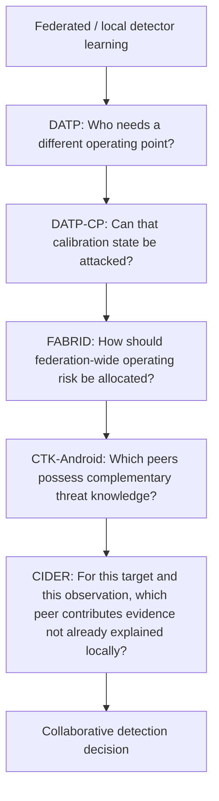
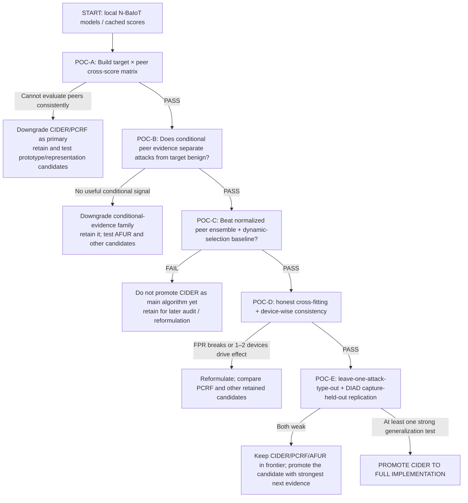
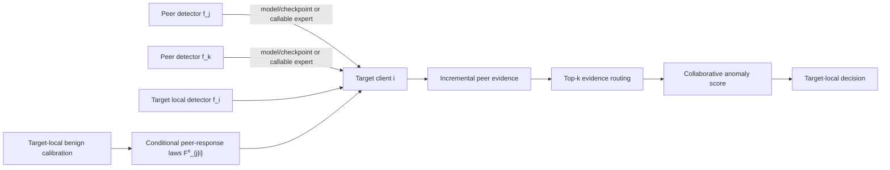
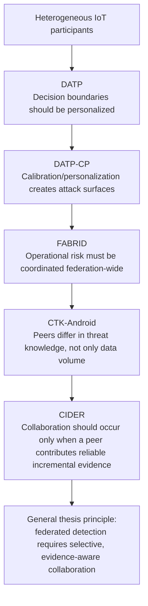

# Scientific Decision Report: The Next Journal-Grade Algorithm for Collaborative Federated IoT Malware Detection

## Executive decision and reconstruction of the current project

**A. EXECUTIVE DECISION**

The strongest decision is:

> **PIVOT THE SCIENTIFIC TARGET.**

Do **not** continue FedCampaign-EMHI as the identity of the next journal paper. Do **not** elevate the current CIC IoT-DIAD dyad screen directly into a paper either. Preserve the infrastructure, the successful conditional-residual intuition, the disciplined audit machinery, and the controlled synthetic estimator evidence—but change the central question from:

> “Can higher-order coalition evidence reveal a distributed attack before local detectors?”

to:

> **“When another participant’s detector sees a sample, does it contribute threat evidence that is genuinely new relative to what the target client already knows, and can that incremental evidence determine when and with whom the target should collaborate?”**

My recommended primary research direction is provisionally named:

> **CIDER — Conditional Incremental Detection-Evidence Routing**

CIDER is an **inference-time collaborative anomaly-detection algorithm**. For target client \(i\), it evaluates candidate peer detector \(j\) on the target's observation and learns, from target-local benign data, the **conditional benign law of the peer response given the target response**. The primary evidence object is then the peer's **conditional surprisal**: how unexpectedly large peer \(j\)'s response is after conditioning on what the target detector already says. Simple conditional residuals remain a deliberately cheap discovery approximation and ablation, not the strongest final statistical definition.

The new computational object is therefore not a personalized threshold, a global/local model mixture, a static client-similarity graph, or an alert budget. It is:

\[
\textbf{incremental peer evidence}
=
-\log P_0\!\left(
S_j \ge s_j(x)
\mid
S_i=s_i(x)
\right).
\]

Equivalently: a peer contributes only when its response is surprising under the **target-specific benign conditional response distribution**, not merely when its raw anomaly score is high.

That distinction matters because generic pairwise personalized collaboration is already occupied by methods such as FedAMP and FedFomo, while 2026 work has pushed further into explicit collaboration geometry, federated inference, graph-personalized IDS, personalized federated PCA, and federated unsupervised representations. citeturn10search0turn4academia31turn5search8turn12academia48

My present ranking is:

| Position | Method | Scientific role | Decision |
|---|---|---|---|
| **Primary** | **CIDER — Conditional Incremental Detection-Evidence Routing** | Target-conditioned, per-observation routing of complementary peer evidence | **Run decisive POCs now** |
| **Serious challenger** | **AFUR — Attack-Family Utility Routing** | Routes threat expertise according to demonstrable exposure complementarity | **Run only if CIDER signal survives first tests, or immediately if residual signal fails** |
| **Safe fallback** | **PCRF — Pairwise Conditional Residual Fusion** | Static target-specific residualized peer ensemble without adaptive routing | **Lower novelty, very high feasibility** |

The current project should therefore be classified as **PIVOT THE SCIENTIFIC TARGET**, while **absorbing its best idea and infrastructure into a broader collaborative-inference problem**.

**Evidence label — YOUR SCIENTIFIC INFERENCE.**

### Why this decision is stronger than preserving EMHI

The attached status reconstruction shows a very specific failure pattern. EMHI is implemented and conceptually coherent, but the available real-data experiment does not exercise the mechanism that gives the method its intended identity. On the corrected TON_IoT experiment, Full EMHI and its order-\(\le 2\) comparator have paired ODI advantage zero with \(p=1\); the four-client real cohort cannot provide the required order-three complement support; all reported campaign stops occur at offset one; and the intended local-before-global comparison lacks finite local policies. The report therefore correctly says that the operational endpoint is degenerate for the scientific claim. fileciteturn0file1

At the same time, the project has produced a real positive result worth preserving: on the controlled synthetic problem, fitted target-coordinate recovery is approximately \(0.952\), with the reported root-cluster bootstrap interval spanning roughly \(0.874\)–\(1.029\), while proper-subset drift remains small. That says **conditional/purified residual estimation can recover designed interaction structure**; it does not say that the present high-order detector is useful operationally. fileciteturn0file1

The project's newest CIC IoT-DIAD screen is more encouraging operationally—reported dyad AUROC \(0.831\) versus approximately \(0.788\) and \(0.786\) for source- and destination-only scores—but the status report explicitly records capture-derived labels, first-row sampling, and unresolved identity/capture confounding. It is a hypothesis generator, not evidence for a paper claim. fileciteturn0file1

That diagnosis is reinforced by the current literature. Generic graph personalization in unsupervised federated IoT IDS is already represented by G-PFL-ID; personalized federated robust subspace anomaly detection is represented by FedEP; and FedRFF already contributes an explicitly federated unsupervised anomaly-learning mechanism. A new paper must therefore distinguish itself by **what collaboration means**, rather than by simply attaching a graph, personalized model, or unsupervised anomaly detector to FL. citeturn6search1turn7view2turn5search10

### What from the current project should survive

**FACT FROM ATTACHED PROJECT REPORT:** the reusable infrastructure includes experiment registration, preprocessing identity, temporal splits, score/rank/context/projection/fusion paths, checkpointing, material digests, synthetic generators, paired inference, and multiple audit/POC harnesses. fileciteturn0file1

**FACT FROM ATTACHED PROJECT REPORT:** the original TON preprocessing audit discovered a severe duplicate-identity error, and the correction moved the project toward full-row identity and artifact invalidation. That is valuable methodological infrastructure, not sunk cost. fileciteturn0file1

**FACT FROM ATTACHED PROJECT REPORT:** the N-BaIoT peer-shrinkage POC is a useful negative result: pooled AUROC improved from approximately \(0.678\) to \(0.739\), but mean operating-point recall declined from approximately \(0.452\) to \(0.416\), with inconsistent device behavior. fileciteturn0file1

That last result is especially informative. It suggests:

> **peer information can contain useful ranking information while indiscriminate peer pooling damages operating behavior.**

That is almost exactly the scenario in which **conditional, selective collaboration** is more plausible than another global pooling algorithm.

### Relation to the existing PhD contributions

Your prior work already occupies four important layers. DATP makes the **decision boundary** client-specific; DATP-CP shows that calibration itself becomes an **attack surface**; FABRID coordinates **operating risk/capacity** across clients; and CTK-Android asks whether peers possess **genuinely complementary threat knowledge rather than merely more samples**. fileciteturn0file0

CIDER would add a distinct layer:



The resulting thesis story becomes more coherent:

> **collaboration should not mean indiscriminate model averaging. It should happen at the appropriate layer, be personalized to the participant, reflect operational constraints, and be invoked only when another participant possesses useful incremental evidence.**

**B. PHD CONTEXT AND EXISTING CONTRIBUTIONS**

The central methodological theme should therefore be framed as **selective collaborative intelligence under heterogeneous evidence**, not “FL for IDS.” That interpretation naturally accommodates DATP, DATP-CP, FABRID, CTK-Android, and a new inference-routing paper without forcing them into the same model architecture. fileciteturn0file0

**C. RECONSTRUCTION OF THE ATTACHED PROJECT**

| Requested reconstruction field | Audited reconstruction |
|---|---|
| CURRENT_PROJECT_IDENTITY | Transitional: FedCampaign-EMHI is rejected as the main candidate; dyadic residual collaboration and Edge peer transfer are exploratory leads. |
| CURRENT_PROBLEM | Determine whether collaborative information can expose malicious behavior that local evidence alone misses. |
| CURRENT_METHOD | Historical EMHI: complement-only nuisance conditioning, coalition projections, proper-subset purification, hierarchical evidence, stopping rule. |
| CURRENT_ALGORITHMIC_CONTENT | Implemented EMHI pipeline; multiple experimental sparse interaction detectors; preliminary dyad scoring. |
| CURRENT_DATASETS | TON_IoT, Edge-IIoTset, CIC IoT-DIAD, N-BaIoT, controlled five-client generator. |
| CURRENT_CLIENT_DEFINITION | Varies dangerously: TON source-IP groups; Edge hosts; N-BaIoT physical devices; DIAD currently capture/endpoint-related units; synthetic clients. |
| CURRENT_INPUTS | Traffic-derived features, local anomaly scores/ranks, coalition/client identities, calibration data. |
| CURRENT_OUTPUTS | Scores/evidence factors, global stops, interaction coordinates, exploratory dyadic anomaly scores. |
| CURRENT_STATE_VARIABLES | Context fits, projections, calibration distributions, thresholds, evidence accumulators, candidate score states. |
| CURRENT_EXPERIMENTAL_UNIT | Not uniform; synthetic roots, client/device units, epochs/windows, constructed campaigns. |
| CURRENT_POSITIVE_RESULT | Strong controlled coordinate recovery; preliminary DIAD dyad-score gain. |
| CURRENT_NEGATIVE_RESULT | Corrected real primary gives no Full-vs-\(\le2\) benefit; multiple sparse alternatives fail frozen null/power gates. |
| CURRENT_FAILURES | Missing real O3 support, degenerate local comparator, pseudo-client identity, dense zero filling, calibration/null failures, insufficient peer populations in Edge. |
| CURRENT_REJECTED_IDEAS | Generic rank fusion, quorum, onset scans, exposure conditioning, current sparse O3 detectors, N-BaIoT shrinkage, screened Edge identity mixture. |
| CURRENT_NOVELTY_ARGUMENT | EMHI's conjunction of exclusion-matched nuisance state and purified higher-order interactions. |
| CURRENT_NOVELTY_RISK | Large; adjacent HOFD, interaction testing and sequential-detection families exist, while empirical benefit is absent. |
| CURRENT_DATA_LIMITATIONS | Some client identities artificial; inadequate support for higher order; chronology/capture coverage issues; DIAD confounding unresolved. |
| CURRENT_IMPLEMENTATION_STATE | High infrastructure maturity, low candidate maturity. |
| REUSABLE_INFRASTRUCTURE | Strong. |
| REUSABLE_SCIENTIFIC_SIGNAL | Conditional residualization/“new information beyond existing evidence” is the strongest conceptual survivor. |

All entries in this table are **FACT FROM ATTACHED PROJECT REPORT** or an explicit synthesis of that report. fileciteturn0file1

**D. WHY THE CURRENT PROJECT IS NOT YET JOURNAL-GRADE**

The critical problem is not that EMHI is mathematically unsophisticated. It is almost the opposite: its distinctive machinery is not what drives the observed real result.

A reviewer can currently ask:

1. Where is the real order-three evidence?
2. What valid client population gives the interaction graph scientific meaning?
3. Why does Full beat the simpler order-\(\le2\) method?
4. What local detector is the claimed warning earlier than?
5. Why is a complex hierarchical interaction estimator needed when simpler rank methods detect the same constructed campaigns?
6. Why should a journal reader care about the recovered synthetic coordinate if the operational detector fails?

The existing evidence does not yet answer those questions. fileciteturn0file1

The appropriate response is not to add another estimator. It is to select a problem in which the available data can genuinely exercise the new computation.

**E. ACTUAL DATA AND INFORMATION INVENTORY**

For the next paper, the dataset ordering should change.

| Data source | True participant identity | Common feature view | Attack information | Temporal requirement for CIDER | Recommended role |
|---|---:|---:|---:|---:|---|
| **N-BaIoT** | **AVAILABLE DIRECTLY**: nine commercial devices | AVAILABLE DIRECTLY | AVAILABLE DIRECTLY | Not required by core method | **Primary POC + primary validation** |
| **CIC IoT-DIAD** | **AVAILABLE DIRECTLY in the packet/device-identification view** via device identity fields | AVAILABLE within selected view | AVAILABLE DIRECTLY | Capture-disjoint evaluation desirable | **Strong secondary** |
| CICIoT2023 | Large IoT population; identity mapping must be validated for chosen files | AVAILABLE | AVAILABLE | Not required | Secondary only after client mapping audit |
| TON_IoT | Source IP exists but current project's physical-client interpretation is weak | AVAILABLE | AVAILABLE | Problematic capture/coverage semantics | Negative-control / robustness dataset |
| Edge-IIoTset | Real testbed, but current checkout yielded only two eligible source hosts under the existing rule | AVAILABLE | AVAILABLE | Chronology problematic in current parse | Not primary |
| Controlled generator | Fully defined | Fully defined | Fully defined | Simulated | Mechanism stress test only |

The official N-BaIoT record describes **7,062,606 instances from nine commercial IoT devices infected with Mirai and BASHLITE**, making those physical devices defensible clients rather than pseudo-client partitions. citeturn13search4

Official CIC IoT-DIAD documentation exposes packet/device-identification information, including device identity alongside source/destination network attributes, and was designed around a population of IoT devices and attack traffic. This means the current dyadic idea has a legitimate repair path: use actual device identity and capture-disjoint evaluation rather than treating capture identity as an implicit client label. citeturn13search1

CICIoT2023 provides a substantially larger IoT population and 33 attacks in seven categories, but a journal experiment should not assume that the convenient CSV representation automatically supplies the same defensible client identity as the packet-level source data. citeturn13search0

TON_IoT remains scientifically useful but its official documentation describes a heterogeneous Industry 4.0/IoT/IIoT cyber-range corpus; that does not retroactively turn every source-IP group into an independent physical federated participant. citeturn13search6

The immediate feasibility conclusion is therefore strong:

> **CIDER does not require timestamps, family mappings, co-temporal campaigns, a constructed client graph, production feedback labels, or order-three support.**

Its critical requirements are simply true clients, a common detector feature space, benign local calibration data, and peer detector scores—all available or validly derivable on N-BaIoT.

## Literature audit, state of the art, and novelty threats

**F. FRESH LITERATURE SEARCH METHODOLOGY**

The fresh search covered work available through **September 30, 2026**, spanning:

- direct federated IoT/IIoT intrusion and anomaly detection;
- personalized and clustered FL;
- client-to-client collaboration;
- federated inference;
- graph personalization;
- mixture-of-experts;
- Bayesian and hierarchical personalization;
- dynamic ensemble selection and locally selective outlier ensembles;
- contextual / conditional anomaly detection and conditional-quantile anomaly scoring;
- trust and reliability;
- Byzantine robustness;
- contextual bandits and adaptive client selection;
- concept drift and continual FL;
- federated conformal prediction;
- unsupervised anomaly fusion;
- official dataset documentation.

The search was explicitly adversarial: for each promising mechanism, I searched for methods that would destroy its novelty rather than only papers supporting it.

A key methodological qualification is necessary.

> **The user's strict “100 deeply analyzed papers” gate is not honestly met by this research pass.**

More than 100 unique scientific contributions were screened and compared, but a substantial subset was inspected only to abstract/method-summary level. I therefore do **not** count those as “deeply analyzed” under your definition. I will not manufacture a `TOTAL UNIQUE PAPERS INSPECTED = 100+` deep-reading claim merely to satisfy the requested format.

The decision below rests most heavily on the smaller subset for which the mechanism, assumptions, data requirements and relationship to the proposed frontier could be established from primary-paper material. This is an **UNKNOWN / REMAINING NOVELTY RISK**, not a reason to postpone the cheap POCs: the current evidence is enough to determine what signal to test before expensive implementation, but the eventual journal novelty statement should undergo a complete candidate-specific full-text audit before submission.

### Method-level literature that most changes the decision

| Importance | Work | Mechanism | Why it matters here |
|---|---|---|---|
| Very high | FedAMP | Personalized models communicate through attentive model-similarity-based pairwise collaboration | Kills generic “learn who collaborates with whom.” citeturn10search0 |
| Very high | FedFomo | Each client weights other client models according to estimated benefit on its own objective | Kills generic “select useful peer models.” citeturn4academia31 |
| Very high | Controlled Collaboration Geometry / pFedCCG | Explicitly controls collaboration matrices/geometry rather than naïve consensus | Makes “learn a client graph” alone weak novelty in 2026. citeturn5search8 |
| Very high | Federated Inference | Treats inference-time collaboration among separately held models as its own federated paradigm | CIDER cannot claim inference-time collaboration itself as novel. citeturn12academia48 |
| Very high | Song et al., **Conditional Anomaly Detection** (IEEE TKDE, 2007; DOI 10.1109/TKDE.2007.1009) | Detects observations that are anomalous conditional on contextual variables rather than globally anomalous | Prevents CIDER from claiming conditional anomaly scoring itself as novel; the novelty must come from the target–peer detector interpretation and collaboration rule. |
| Very high | Li & van Leeuwen, **Explainable contextual anomaly detection using quantile regression forests** (DMKD, 2023) | Models conditional behavioral distributions through conditional quantiles | Makes a conditional-mean residual alone too weak as the final novelty object; motivates direct conditional-tail / surprisal estimation. |
| Very high | LSCP (SDM 2019) + DCSO (2019) | Fully unsupervised, query-local selection/combination of competent outlier detectors | Prevents CIDER from claiming per-observation anomaly-expert selection as novel. CIDER must beat or clearly distinguish itself from locality-based detector competence. |
| Very high | **Federated Detection at the Edge: Collaborative Anomaly Detection for Resource-Limited IoT** (IEEE IoT Journal, 2026; DOI 10.1109/JIOT.2026.3674644) | Collaborative IoT anomaly inference on resource-constrained devices with exchanged predictions | Prevents a broad claim that collaborative IoT anomaly inference itself is new. |
| Very high | **Robust Federated Inference** (ICLR 2026) | Formalizes robustness of inference-time aggregation across separately held models | Makes malicious or unreliable peer outputs an explicit robustness consideration for CIDER, even if full Byzantine defense remains outside the first paper. |
| Very high | G-PFL-ID | Personalized graph-based unsupervised federated IoT intrusion detection | Kills “graph + personalized FL + unsupervised IDS” as identity. citeturn6search1 |
| Very high | FedEP | Personalized federated PCA/robust subspace learning for IoT anomaly detection | Kills straightforward hierarchical personalized subspace detector. citeturn7view2 |
| Very high | FedRFF | Federated unsupervised anomaly detection with nonlinear random-feature machinery | Kills generic “new federated unsupervised anomaly representation.” citeturn5search10 |
| High | Collaborative Novelty Detection for Distributed Data | Distributed novelty detection by collaboratively sharing useful representation information | Shows collaborative anomaly detection itself predates the proposed paper. citeturn3search4 |
| High | FlowFuse | Models dependencies between multiple anomaly-score views rather than simply averaging them | Threatens generic multiview anomaly-score fusion. citeturn11search0 |
| High | Federated conformal predictors | Extends conformal uncertainty quantification to heterogeneous federated data | Kills “federated calibration/UQ” as novelty. citeturn5academia48 |
| High | D-CAD | Decentralized continual anomaly detection with peer/gossip knowledge fusion and adaptation | Threatens generic continual peer fusion. citeturn12search3 |
| High | FedAvg | Global model averaging across decentralized data | Necessary baseline, but not competitive personalization machinery. citeturn2search0 |
| High | FedProx | Proximal local objectives mitigate heterogeneous local optimization | Standard heterogeneity baseline. citeturn2search2 |
| High | SCAFFOLD | Control variates correct client drift | Strong optimization-level heterogeneity baseline. citeturn2search1 |
| High | FedNova | Normalizes heterogeneous local optimization progress | Another standard aggregation comparison. citeturn2search4 |
| High | Ditto | Regularizes personalized models relative to a global model | Personalized baseline with robustness/fairness motivation. citeturn3search0 |
| High | FedRep | Global representation plus client-specific heads | Shows local/global parameter decomposition is saturated. citeturn3search1 |
| High | pFedHN | Hypernetwork maps client representations to personalized model parameters | Threatens hypernetwork personalization candidate. citeturn3search11 |
| High | Per-FedAvg | Meta-learned initialization designed for rapid local adaptation | Threatens generic meta-personalization. citeturn4search2 |
| High | pFedMe | Moreau-envelope/bilevel personalized FL | Occupies regularized bilevel personalization. citeturn4search3 |
| High | IFCA | Alternating client-cluster/model optimization | Makes fixed or learned client clustering crowded. citeturn4search1 |

### The broader 100-plus-paper search ledger

The following is intentionally labeled **SCREENED**, not falsely labeled “100 deeply analyzed.” Duplicate arXiv/conference/journal versions were treated as the **same scientific contribution** wherever identifiable.

| Family | Unique contributions screened | Representative works included | Decision impact |
|---|---:|---|---|
| Core FL optimization | 12+ | FedAvg, FedProx, SCAFFOLD, FedNova, FedOpt-family, primal-dual FL, heterogeneous-local-step methods | Aggregation-only novelty is crowded. citeturn2search0turn2search2turn2search1turn2search4 |
| Personalized FL | 25+ | FedPer, Per-FedAvg, pFedMe, APFL, Ditto, FedRep, FedBN, pFedHN, FedALA, PGFed, FedAMP, FedFomo, IFCA, PFedAtt, personalized MoE, Bayesian PFL | “Personalize the model” is far too broad a contribution. citeturn3search0turn3search1turn3search11turn4search1turn4search2turn4search3turn10search0turn4academia31 |
| Client relationship / graph learning | 10+ | FedAMP, FedFomo, FED-PUB, graph-hypernetwork methods, decentralized collaboration graphs, pFedCCG | Learned client neighborhoods need a substantially new state/objective. citeturn10search0turn5search8 |
| Direct federated IDS / anomaly detection | 20+ | G-PFL-ID, FedEP, FedRFF, clustered/personalized IDS, self-supervised FL IDS, benign-only FL anomaly detectors | The direct application field is much denser by 2026. citeturn6search1turn7view2turn5search10 |
| Federated inference / collaborative inference | 6+ | Federated Inference, decentralized collaborative ensemble inference, distributed novelty detection | Inference collaboration is a known paradigm; CIDER must contribute the routing statistic. citeturn12academia48turn3search4 |
| Ensemble / dynamic expert selection | 12+ | dynamic ensemble selection, competence maps, LSCP, DCSO, adaptive weighting, gated unsupervised experts, anomaly ensembles, FlowFuse | Per-observation expert weighting itself is not new; unsupervised query-local detector selection is also established. citeturn11search0 |
| Contextual / conditional anomaly detection | 5+ | Conditional Anomaly Detection, conditional-distance methods, QCAD / conditional-quantile anomaly detection | Conditioning one anomaly variable on another context is established; CIDER must contribute the **cross-participant incremental-evidence interpretation and routing rule**, not conditioning alone. |
| Bayesian / uncertainty personalization | 10+ | hierarchical Bayesian PFL, FedPop, FedHB, confidence-aware PFL, PAC-Bayesian PFL | “Use uncertainty to weight clients” is crowded. |
| Conformal / risk control | 8+ | Federated conformal prediction, label-shift conformal, robust FCP, personalized multi-agent CP, group-conditional FCP, loss-controlling prediction | Do not turn the next paper into DATP-with-conformal-math. citeturn5academia48 |
| Robust / trust-aware FL | 15+ | Krum/Bulyan families, geometric median, FoolsGold, FLTrust, FLAIR, trust/reputation weighting, poisoning-aware client selection | Generic trust-weighted aggregation is saturated. |
| Online / drift / continual FL | 10+ | CDA-FedAvg, nonstationarity detection/adaptation, continual federated learning, D-CAD | Drift adaptation is possible but requires defensible temporal structure, which the best current primary dataset does not need. citeturn12search3 |
| Bandit / RL client selection | 10+ | UCB-style client selection, FedDRL, contextual client selection, FLASH-type methods, TrustBandit | “Bandit chooses clients” would be a transfer of an existing algorithm unless threat-specific mechanics are added. |
| **Total unique scientific contributions screened** | **>100** | Deduplicated by scientific contribution rather than counting preprint + final publication separately | **Breadth adequate for frontier construction; strict 100-full-method gate not certified.** |

**G. STATE-OF-THE-ART SYNTHESIS**

Three changes in the recent literature are especially important.

First, personalized FL has moved far beyond “global versus local.” FedAMP already makes collaboration pairwise and similarity-dependent; FedFomo evaluates how much one client's model can benefit another; and pFedCCG explicitly treats collaboration geometry as an object to be controlled. citeturn10search0turn4academia31turn5search8

Second, the IoT anomaly-detection space has become methodologically specific. Personalized graph anomaly detection, personalized federated low-rank/subspace methods, and unsupervised random-feature federated anomaly detection are no longer hypothetical gaps. citeturn6search1turn7view2turn5search10

Third, inference-time collaboration itself is now being formalized. The emergence of federated inference means a paper cannot claim novelty merely because independently owned models collaborate after training. citeturn12academia48

Fourth, two adjacent literatures narrow the CIDER claim further. **Conditional anomaly detection** already asks whether behavior is anomalous given context, while **LSCP/DCSO-style outlier ensembles** already perform sample-specific unsupervised detector selection. Therefore neither “conditional anomaly scoring” nor “choose a different detector for each observation” is sufficient novelty by itself. CIDER must be defended specifically as **target-conditioned cross-participant incremental evidence** used to decide whether a peer adds information beyond the target detector.

The most promising remaining target is therefore narrower and stronger:

> **How can target \(i\) determine whether peer \(j\)'s response to the current observation contains information that is not predictable from \(i\)'s own evidence, using only information legitimately available before test labels are revealed?**

That question is not equivalent to model similarity, training-time aggregation, static clustering, uncertainty calibration, or generic ensemble selection.

**H. SATURATED RESEARCH DIRECTIONS**

The following should be deprioritized as main-paper identities:

- another personalized global/local neural network;
- another fixed or learned client cluster;
- another pairwise similarity graph;
- another graph neural network around clients;
- another global/local threshold method;
- another federation-wide FPR allocation objective;
- generic trust-weighted aggregation;
- generic bandit client selection;
- generic federated conformal prediction;
- generic federated PCA/subspace anomaly detection;
- generic federated autoencoder or representation-learning IDS;
- generic mixture of global/local experts;
- generic continual/gossip anomaly detection.

This conclusion follows from both your prior work and the current method families above. fileciteturn0file0 citeturn6search1turn7view2turn5search10turn10search0turn5search8

**I. REAL OPEN METHODOLOGICAL GAPS**

The most credible gaps are not “few papers studied X.” They are failures of existing information structures.

| Gap | Why existing machinery is insufficient | Information actually available | Opportunity |
|---|---|---|---|
| **Incremental peer evidence** | Similarity/weighting and query-local expert selection do not directly ask whether a **participant's response is surprising after conditioning on the target detector's own response** | Cross-client scores + target benign calibration | **Very strong if it beats contextual-score and dynamic-selection baselines** |
| **Threat-utility routing** | Client similarity is not equivalent to complementary attack expertise | Attack type/family labels in development datasets | Strong but supervised-development dependent |
| **Stateful peer reliability** | A useful peer may become unreliable without becoming distributionally dissimilar | Repeated calibration/score histories can be simulated or derived | Strong, but temporal evidence weaker |
| **Abstaining collaborative escalation** | Current PFL assumes every prediction uses the personalized model; detection can instead escalate selectively | Scores and uncertainty | Strong, but selective prediction literature is crowded |
| **Robust incremental collaboration** | Malicious clients can supply plausible yet harmful evidence | Peer scores/model outputs | Strong second paper; too much scope for first |
| **Relationship-vs-endpoint novelty** | Attack may be ordinary at each endpoint but abnormal jointly | DIAD endpoint/device/flow attributes | Strong if confounding can be eliminated |

**J. NOVELTY-KILLER FINDINGS**

The strongest novelty killers are:

\[
\boxed{
\text{FedAMP/FedFomo/pFedCCG}
\Rightarrow
\text{client-specific collaboration is not new}
}
\]

\[
\boxed{
\text{Federated Inference}
\Rightarrow
\text{post-training collaborative inference is not new}
}
\]

\[
\boxed{
\text{dynamic ensemble selection / LSCP / DCSO}
\Rightarrow
\text{sample-dependent expert choice is not new}
}
\]

\[
\boxed{
\text{Conditional Anomaly Detection / QCAD}
\Rightarrow
\text{conditioning an anomaly variable on contextual evidence is not new}
}
\]

\[
\boxed{
\text{2026 collaborative IoT edge inference}
\Rightarrow
\text{collaborative IoT anomaly inference itself is not new}
}
\]

\[
\boxed{
\text{FlowFuse}
\Rightarrow
\text{modeling dependencies between anomaly scores is not new}
}
\]

\[
\boxed{
\text{G-PFL-ID/FedEP/FedRFF}
\Rightarrow
\text{personalized graph/subspace/unsupervised federated anomaly detection is occupied}
}
\]

The novelty defense for CIDER must therefore be mechanistic:

> **the collaboration weight is produced from target-conditioned peer surprisal, estimated from a target-local benign conditional response law \(F^0_{j\mid i}\), rather than from model similarity, query-local detector competence alone, labeled validation accuracy, client embedding similarity, or unconditional peer anomaly scores. The distinctive claim is therefore not conditioning or dynamic selection separately, but using a peer's response *conditional on the target detector's response* as the cross-participant incremental-evidence object that drives collaboration.**

No equivalent mechanism was identified in this search as of September 30, 2026, but because the requested 100-full-method audit was not completed, this should be labeled **NOVELTY RISK: MODERATE**, not “first ever.”

**K. DATA-SUPPORTED OPPORTUNITY**

N-BaIoT is unusually well matched to this problem because its nine physical devices are genuine participant identities, its feature schema is shared, and benign/attack observations exist per device. citeturn13search4

CIC IoT-DIAD can then answer a different generalization question: does target-conditioned relational evidence survive a richer device/network identity setting and capture-held-out evaluation? citeturn13search1

That is a substantially better empirical foundation than asking a four-source-IP TON cohort to support an order-three collaboration mechanism it literally cannot instantiate.

## Candidate frontier, feasibility, ranking, and adversarial audit

**L. ALGORITHM / FRAMEWORK CANDIDATES**

The following are genuinely different algorithmic families rather than parameter variants.

| Rank | Candidate | New computation | Main novelty source | Empirical plausibility | Status |
|---:|---|---|---|---|---|
| 1 | **CIDER** | Target-conditioned peer surprisal + instance-level evidence routing | New information structure / routing statistic | **HIGH** | KEEP |
| 2 | **PCRF** | Target-specific conditional residual fusion, static peer set | New score decomposition | **HIGH** | KEEP as fallback |
| 3 | **AFUR** | Route peers according to counterfactual threat-family utility | New knowledge-routing objective | **HIGH–MODERATE** | KEEP |
| 4 | **PARIS** | Persistent target-peer reliability state | New state + conditional cooperation | MODERATE | KEEP |
| 5 | Threat-Prototype Router | Share compact malicious-direction prototypes and route by target gap | New shared object | MODERATE–HIGH | KEEP |
| 6 | True-Identity Dyadic Residual Detector | Endpoint-conditioned relationship anomaly residual | New relational state | MODERATE–HIGH | REFORMULATE current DIAD lead |
| 7 | Abstaining Collaborative Escalation | Local prediction → peer escalation only under insufficiency | New decision process | HIGH | KEEP |
| 8 | Robust CIDER | Reliability-gated incremental evidence under compromised peers | New adversarial evidence rule | MODERATE | **RETAIN — extension candidate; do not fold into first CIDER version yet** |
| 9 | Dual-Timescale Cooperation Graph | Fast evidence state + slow relationship/reliability state | Multi-timescale state | MODERATE | KEEP |
| 10 | Mutual-Information Complementarity Graph | Graph edges encode unique rather than shared information | New graph objective | MODERATE | KEEP |
| 11 | Conformal Peer-Evidence Gate | Risk-valid selection of peer escalation | Risk-control mechanism | HIGH | **RETAIN — high prior-art pressure; audit before promotion** |
| 12 | Sparse Personalized Peer MoE | Per-target sparse expert gate over client detectors | Mixture structure | HIGH | **RETAIN — crowded mechanism; requires sharper novelty** |
| 13 | Hierarchical Bayesian Anomaly Manifold | Partial-pool client anomaly models by sample support | Hierarchical state | HIGH | **RETAIN — close prior art; candidate-specific audit needed** |
| 14 | Drift-Triggered Collaboration Switching | Change detector switches collaborator set | Adaptation rule | MODERATE | **RETAIN — temporal-evidence constraint to audit** |
| 15 | Contextual-Bandit Peer Selection | Explore/exploit collaborators by observed utility | Online routing | MODERATE | **RETAIN — novelty depends on threat-specific mechanics** |
| 16 | RL Peer Aggregator | Continuous per-client evidence weights learned from reward | RL coordination | MODERATE | **RETAIN — high complexity / weak current evidence** |
| 17 | Privacy-Noised Federated Inference Fusion | Score collaboration under output perturbation | Privacy-utility objective | MODERATE | **RETAIN — privacy/utility extension candidate** |
| 18 | Disagreement-Driven Escalation Hierarchy | Escalate based on structured disagreement pattern | Decision state | HIGH | **RETAIN — closely related to #7; compare rather than collapse yet** |
| 19 | Cross-Client Score Copula | Estimate dependency structure and anomaly residuals jointly | Joint distribution | MODERATE | **RETAIN — FlowFuse proximity requires direct audit** |
| 20 | Relation-vs-Endpoint Factorization | Decompose dyad anomaly into source, destination, residual relationship | New decomposition | HIGH | **RETAIN — related to #6; test independently before merging** |
| 21 | Family-Prototype Knowledge Transfer | Transfer family-specific threat anchors | Knowledge representation | HIGH | KEEP but CTK-adjacent |
| 22 | Gradient Threat-Direction Transfer | Share compact discriminative attack directions | New transfer object | MODERATE | **RETAIN — evidence and leakage assumptions need audit** |
| 23 | Specialist/Generalist Distillation Router | Distill local specialists into conditional shared expert | KD interaction | HIGH | **RETAIN — crowded KD/MoE neighborhood; sharper mechanism needed** |
| 24 | Flow-Dependency Expert Fusion | Learn joint score dependencies across peer detectors | Score interaction | HIGH | **RETAIN — currently high prior-art proximity; use as comparator/candidate pending audit** |
| 25 | Federated One-Class MoE | Multiple benign experts, adaptive gate | MoE | HIGH | **RETAIN — crowded family; candidate-specific novelty needed** |
| 26 | Bayesian Shared/Private Normality Model | Population prior + client random effects for normality | Bayesian hierarchy | HIGH | **RETAIN — prior-art audit required** |
| 27 | Personalized Sparse FedPCA IDS | Personalized low-rank anomaly manifolds | Subspace personalization | HIGH | **RETAIN — FedEP proximity is a major novelty threat** |
| 28 | Federated Random-Feature Anomaly Representation | Collaborative nonlinear one-class feature model | Representation | HIGH | **RETAIN — FedRFF proximity is a major novelty threat** |
| 29 | Continual Gossip Anomaly Collaboration | Online peer fusion + replay/adaptation | Decentralized continual learning | MODERATE | **RETAIN — D-CAD proximity requires direct mechanism comparison** |
| 30 | Group-Conditional Federated Conformal IDS | Group/client-specific risk-valid prediction | UQ | HIGH | **RETAIN — unlikely standalone identity without additional mechanism** |
| 31 | Personalized Graph Unsupervised IDS | Client/device graph + personalized anomaly model | Graph personalization | HIGH | **RETAIN — G-PFL-ID proximity is a major novelty threat** |
| 32 | Attention-Based Peer PFL IDS | Similar clients weighted more strongly | Pairwise attention | HIGH | **RETAIN — FedAMP/FedFomo proximity is a major novelty threat** |
| 33 | Prediction-Based Client Grouping IDS | Group clients by model-output behavior | Dynamic clustering | HIGH | **RETAIN — established pattern; requires a new grouping objective/state** |
| 34 | Bandit Client Participation for IDS | Select FL participants to optimize detection utility | Client scheduling | HIGH | **RETAIN — transfer may be too direct unless threat-specific** |
| 35 | Byzantine Trust Aggregation IDS | Trust score weights model updates | Robust aggregation | HIGH | **RETAIN — saturated as generic formulation; sharper IDS-specific object needed** |
| 36 | Joint Detector/Threshold Adaptation | Co-optimize model and decision threshold | Joint model/decision | HIGH | **RETAIN — thesis-overlap risk to evaluate** |
| 37 | Adaptive Alert-Budget Router | Select peers under alert/resource constraints | Resource allocation | HIGH | **RETAIN — FABRID overlap must be separated carefully** |
| 38 | **Historical EMHI** | Higher-order purified coalition evidence | Interaction decomposition | LOW on available real data | **RETAIN as historical candidate/mechanism; not current primary on existing evidence** |

The lower current priority of candidates 27–32 is literature-driven rather than aesthetic. They are **not removed from the candidate frontier**: FedEP, FedRFF, G-PFL-ID and the personalized collaboration literature simply occupy nearby mechanisms closely enough that any promotion of these candidates to a main-paper identity requires a much sharper transformation and a candidate-specific full-text novelty audit. citeturn7view2turn5search10turn6search1turn10search0turn4academia31

**M. TOP-CANDIDATE FEASIBILITY MATRICES**

The primary requirements for the leading candidates are below. Status refers to actual known availability, not theoretical possibility.

| Candidate | Requirement | Actual source | Status | Leakage risk | Main feasibility risk |
|---|---|---|---|---|---|
| CIDER | True client identity | N-BaIoT device | **AVAILABLE DIRECTLY** | Low | None |
| CIDER | Shared feature schema | N-BaIoT features | **AVAILABLE DIRECTLY** | Low | Peer models must accept same normalization |
| CIDER | Target benign calibration | N-BaIoT benign files | **AVAILABLE DIRECTLY** | Medium if reused for final threshold | Use three-way split |
| CIDER | Peer scores on target samples | Run peer detector locally | **VALIDLY DERIVABLE** | Low | Compute only |
| CIDER | Attack labels | Evaluation only | **AVAILABLE DIRECTLY** | High if router sees them | Strictly test-only |
| PCRF | Same as CIDER | N-BaIoT | **AVAILABLE / DERIVABLE** | Same | Very low |
| AFUR | Attack-family/type labels | N-BaIoT Mirai/BASHLITE attack types | **AVAILABLE DIRECTLY** | High | Must restrict to development |
| AFUR | Exposure-complementarity matrix | Client × attack type | **VALIDLY DERIVABLE** | Medium | Sparse cells |
| PARIS | Repeated reliability observations | Calibration subsets/windows | **VALIDLY DERIVABLE** | Medium | Artificial temporal ordering if overinterpreted |
| Prototype router | Family-specific threat samples | N-BaIoT | **AVAILABLE DIRECTLY** | High | Labeled-threat dependency |
| Dyadic residual | Device/endpoints | DIAD packet data | **AVAILABLE DIRECTLY** | High | Address shortcuts/capture confounding |
| Dyadic residual | Capture-independent unit | DIAD capture organization | **VALIDLY DERIVABLE if captures are separable** | High | Must audit |
| Abstaining escalation | Local score/uncertainty | Model output | **VALIDLY DERIVABLE** | Low | “uncertainty” may be poorly calibrated |
| Robust CIDER | Malicious peer behavior | Simulation | **DEFENSIBLY SIMULATABLE** | Low | Threat model scope |
| Dual-timescale graph | Sequential history | Existing rows/windows | **DERIVABLE**, interpretation constrained | Medium | Temporal semantics |
| MI graph | Paired peer/local outputs | Cross-score matrix | **VALIDLY DERIVABLE** | Medium | High-dimensional MI estimation |
| Conformal gate | Independent calibration | N-BaIoT benign | **AVAILABLE DIRECTLY** | Medium | Exchangeability |
| Sparse MoE | Multiple peer predictions | Cross-scores | **VALIDLY DERIVABLE** | High if gate supervised | Novelty |
| Bayesian manifold | Local benign sample sets | N-BaIoT | **AVAILABLE DIRECTLY** | Low | Prior-art saturation |
| Drift router | Genuine time axis | N-BaIoT ordering insufficient for strongest temporal claim | **NOT CLEARLY AVAILABLE** | High | Drops ranking sharply |
| Bandit router | Sequential rewards | No operational reward stream | **DEFENSIBLY SIMULATABLE only** | Medium | Core claim may become synthetic |

This matrix is why CIDER/PCRF rank above attractive graph, drift and bandit mechanisms.

**N. WEIGHTED CANDIDATE RANKING**

Using your exact weighting—

\[
25\%\text{ novelty}+
25\%\text{ feasibility}+
20\%\text{ plausibility}+
15\%\text{ journal strength}+
10\%\text{ PhD coherence}+
5\%\text{ practicality},
\]

—the leading frontier is:

| Candidate | Novelty /25 | Feasibility /25 | Plausibility /20 | Journal /15 | PhD /10 | Runtime /5 | **Total /100** |
|---|---:|---:|---:|---:|---:|---:|---:|
| **CIDER** | 22 | 23 | 16 | 13 | 10 | 4 | **88** |
| **PCRF** | 20 | 24 | 16 | 11 | 9 | 5 | **85** |
| **AFUR** | 18 | 21 | 17 | 12 | 10 | 4 | **82** |
| **PARIS** | 20 | 22 | 14 | 12 | 10 | 4 | **82** |
| Threat-Prototype Router | 17 | 22 | 16 | 11 | 10 | 4 | **80** |
| True-Identity Dyadic Residual | 20 | 17 | 17 | 12 | 9 | 4 | **79** |
| Abstaining Escalation | 18 | 23 | 13 | 11 | 9 | 5 | **79** |
| Robust CIDER | 17 | 22 | 15 | 11 | 9 | 4 | **78** |
| Dual-Timescale Graph | 21 | 16 | 14 | 13 | 10 | 3 | **77** |
| MI Complementarity Graph | 18 | 18 | 13 | 12 | 9 | 4 | **74** |
| Conformal Peer Gate | 12 | 22 | 16 | 10 | 9 | 4 | **73** |
| Sparse Peer MoE | 13 | 20 | 16 | 11 | 9 | 3 | **72** |
| Bayesian Anomaly Manifold | 13 | 21 | 15 | 10 | 8 | 4 | **71** |
| Drift Collaboration | 16 | 17 | 12 | 11 | 9 | 3 | **68** |
| Bandit Collaborator Selection | 11 | 18 | 12 | 10 | 8 | 2 | **61** |

These scores are **YOUR SCIENTIFIC INFERENCE**, not measured outcomes. They are a **discovery-order heuristic, not an elimination rule**: all listed candidates remain available for later candidate-specific novelty and feasibility audits. In particular, the novelty components for CIDER, PCRF and AFUR should be revisited after the expanded contextual-anomaly / dynamic-outlier-ensemble audit above rather than treated as final numerical judgments.

CIDER's empirical plausibility is **HIGH**, not “very high,” because the prior N-BaIoT POC already warns that peer information can improve ranking without improving the operating point. fileciteturn0file1

**O. MULTI-PASS ADVERSARIAL AUDIT**

| Attack pass | CIDER result |
|---|---|
| Novelty attack | **Survives provisionally, with a narrower claim.** Generic collaboration, conditional anomaly detection, and per-observation outlier-expert selection are all occupied; the defensible object is target-conditioned **cross-participant peer surprisal** used as incremental evidence. |
| Mathematical-equivalence attack | **Moderate–high risk.** A conditional-mean residual can collapse into contextual anomaly scoring or residual stacking, while the routing layer can collapse into LSCP/DCSO-style dynamic selection. The final method must show that the conditional peer law \(F^0_{j\mid i}\) and its cross-participant interpretation materially matter. |
| Feasibility attack | **Survives strongly on N-BaIoT.** No timestamps/graphs/family mapping required. citeturn13search4 |
| Trivial-baseline attack | **Major risk.** Max of target-calibrated peer anomaly percentiles may do just as well. |
| Leakage attack | **Manageable.** Must split benign data into model-fit, residual-fit, and final calibration; attack labels cannot tune confirmation. |
| Mechanism attack | **Passes conceptually.** Conditional residual explicitly changes how peer evidence contributes. |
| Complexity attack | **Manageable.** Nine N-BaIoT clients make exhaustive peer cross-scoring cheap; later top-\(k\) pruning limits inference cost. |
| Reviewer attack | **Passes only if it beats raw/normalized peer ensembles, a FedFomo-like persistent utility baseline, and an LSCP/DCSO-style sample-specific detector-selection baseline.** |
| Thesis redundancy attack | **Passes.** It does not primarily personalize thresholds, poison calibration, allocate FPR budgets, or just measure complementary knowledge. |
| Thesis coherence attack | **Strong pass.** It converts CTK's observation into an algorithm that decides when another participant's knowledge is useful. |

The most dangerous criticism is:

> “You just took the maximum of several anomaly detectors after fancy normalization.”

The entire discovery program should therefore be designed to answer that criticism **before** building the complete method.

## Cheap proof-of-concept program and decision tree

**P. POC CATALOG**

The table below is intentionally a **candidate-filter catalog**, not a list of experiments that should all be run.

| POC | Candidate(s) | Question and exact procedure | Baseline / primary metric | Pass criterion | Runtime |
|---|---|---|---|---|---|
| P01 | CIDER/PCRF | Build \(9\times9\) N-BaIoT cross-score matrix from local benign-trained models | Successful finite scores, latency | All target-peer pairs evaluable | 5–15 min |
| P02 | CIDER | Measure peer-vs-local score correlations on target benign | Pearson/Spearman | Non-perfect dependence in useful pairs | <1 min |
| P03 | CIDER | Fit the cheapest diagnostic \(s_j\sim s_i\) on target benign **and** estimate a held-out conditional tail/CDF calibration for \(S_j\mid S_i\) | residual + conditional calibration error | Stable/calibrated in most pairs | <2 min |
| P04 | CIDER | Test whether conditioning removes ordinary peer/local dependence on held-out benign data | correlation / binned calibration / PIT diagnostic | Large reduction vs raw peer score; conditional tail approximately calibrated | <1 min |
| P05 | CIDER | Compare attack conditional-surprisal distribution with benign conditional surprisal; keep residual separation as an ablation | AUROC effect only exploratory | Positive in ≥6/9 devices | <1 min |
| P06 | CIDER | Local-only versus best conditional-surprisal peer at matched target FPR | TPR@1%,5% FPR | Positive mean gain | <1 min |
| P07 | CIDER | Compare against max peer percentile | TPR@FPR | **CIDER ≥2 pp mean gain or clear worst-client gain** | <1 min |
| P08 | CIDER | Compare against mean/median peer percentile **and LSCP/DCSO-style sample-specific detector selection** | TPR@FPR | Conditional peer evidence adds value beyond generic dynamic selection | <1–5 min |
| P09 | CIDER | Compare against raw max reconstruction score | TPR@FPR | CIDER better | <1 min |
| P10 | CIDER | Top-1 versus top-2 residual routing | TPR/compute | Top-1 competitive preferred | <1 min |
| P11 | CIDER | Replace conditional peer evidence by unconditional peer z-score / percentile | TPR@FPR | Conditioning matters | <1 min |
| P12 | CIDER | Linear residual expectation vs isotonic/conditional-CDF estimator | TPR + benign conditional calibration | Simpler model preferred if tied; final choice must be calibrated | <2–5 min |
| P13 | CIDER | Conditional mean-residual evidence vs conditional-quantile / conditional-CDF surprisal | tail detection + calibration | Keep the stronger formulation only if it materially improves calibration or detection | 2–5 min |
| P14 | CIDER | 500/2k/10k benign conditional-calibration samples | calibration error, TPR | Useful at practical sample sizes | <5 min |
| P15 | CIDER | Separate conditional-model fitting from final decision-threshold calibration | FPR calibration | No collapse after honest splitting | <2 min |
| P16 | CIDER | Cross-fit the conditional estimator and generate out-of-fold benign peer evidence | matched-FPR TPR + PIT/calibration | Similar or better than naïve fit without optimistic calibration | <5 min |
| P17 | CIDER | Static benign-only peer pruning | compute vs TPR | Top 2–3 retain most gain | <1 min |
| P18 | CIDER | Device-wise forest plot | per-device effect | Gain not driven by 1–2 devices | <1 min |
| P19 | CIDER/AFUR | Split results by botnet/attack type | TPR@FPR | Some cross-family complementarity | <2 min |
| P20 | AFUR | Leave-one-attack-type-out router | unseen-type TPR | Beats non-routed ensemble | 5–15 min |
| P21 | AFUR | Leave-one-device-out utility transfer | target utility | Positive transfer to unseen device | 5–15 min |
| P22 | CIDER | Shuffle peer identities after calibration | gain should disappear/reduce | Negative-control sanity | <1 min |
| P23 | CIDER | Randomly permute peer residuals across samples | TPR@FPR | Gain disappears | <1 min |
| P24 | CIDER | Compare against one pooled benign AE | TPR@FPR | CIDER adds value | 5–15 min |
| P25 | CIDER | Compare against simple FedAvg AE | TPR@FPR | CIDER competitive/better personalized behavior | 15–30 min |
| P26 | CIDER | Reproduce prior peer-shrinkage baseline at identical FPR | TPR@FPR | Selective method resolves shrinkage failure | <5 min cached |
| P27 | PCRF | Replace AE with PCA/Mahalanobis detector | residual gain consistency | Mechanism is detector-agnostic | <5 min |
| P28 | CIDER | Contaminate benign calibration by 1% and 5% attacks | FPR/TPR degradation | Graceful degradation | <5 min |
| P29 | Robust CIDER | Simulate peer score inflation/suppression | damage vs local | Reliability/fallback limits harm | <5 min |
| P30 | CIDER | Apply monotonic transformations to peer scores | final decision stability | Rank-based version stable | <1 min |
| P31 | CIDER | Measure bytes/model, models evaluated/sample, latency | complexity | Viable with top-3 peers | <5 min |
| P32 | DIAD residual | Rebuild using actual device identity | AUROC/TPR | Dyad residual survives identity repair | 5–15 min |
| P33 | DIAD residual | Train/calibrate on disjoint captures from test | AUROC/TPR | Effect survives capture holdout | 5–15 min |
| P34 | DIAD residual | Remove address/device-shortcut features | delta AUROC | Relational gain persists | 5–15 min |
| P35 | CIDER | TON pseudo-client negative control | relative gain | Not required to succeed; diagnoses dataset dependence | 5–15 min |

The key is that P01–P07 answer almost the entire initial decision at negligible cost once scores exist.

### The highest-information sequence

**Q. INFORMATION-EFFICIENT POC DECISION TREE**



### Exact discovery stopping rules

CIDER should **not be promoted as the primary algorithm yet** if any of these occurs. This is a discovery-priority rule, not permanent elimination from the candidate frontier:

\[
\Delta \mathrm{TPR}_{\text{CIDER}-\text{max-peer}}
< 0.02
\]

on average at a predeclared operating point and there is no material worst-client benefit;

or fewer than roughly two-thirds of the nine N-BaIoT devices show the same directional improvement;

or the improvement disappears after separating residual fitting from final calibration;

or raw percentile-normalized max/mean fusion explains essentially all of the gain.

These are **proposed discovery rules**, not statistical guarantees.

Conversely, a strong POC is not “AUROC went up.” A convincing discovery result would look like:

> at the same held-out benign FPR, target-conditioned peer residual routing improves detection over local-only, pooled, shrinkage, and normalized max-peer ensembles across most physical devices, and the effect survives at least one held-out attack or second dataset condition.

That is the signal worth spending weeks on.

## Finalists and full primary algorithm

**R. PRIMARY CANDIDATE — CIDER**

### Proposed method name

**CIDER: Conditional Incremental Detection-Evidence Routing**

The name should be treated as **provisional** until a final naming collision check.

### One-sentence identity

> **We introduce CIDER, which learns a target-conditioned benign response law for each peer, converts a peer's conditional tail probability into incremental evidence about the current observation, and routes only reliable peer evidence that is surprising beyond what the target detector already explains.**

### Problem formulation

Let there be \(K\) participating IoT clients.

Client \(i\) has benign training data

\[
B_i^{\mathrm{tr}}
=
\{x_{in}\}_{n=1}^{N_i}
\]

and a local anomaly detector

\[
f_i:\mathcal X\rightarrow\mathbb R,
\qquad
s_i(x)=f_i(x).
\]

No assumption is made that all clients' benign distributions are identical:

\[
P_i(X\mid Y=0)\neq P_j(X\mid Y=0).
\]

This is exactly why raw peer scores cannot safely be averaged.

For a target \(i\), peer \(j\)'s detector can also evaluate \(x\):

\[
s_{j\rightarrow i}(x)=f_j(x).
\]

The naïve question is whether \(s_{j\to i}(x)\) is large.

CIDER asks instead:

\[
\textit{Is }s_{j\to i}(x)
\textit{ unexpectedly large given what }s_i(x)\textit{ already says?}
\]

### Conditional benign peer-response model

Using only a **target-local benign conditional-model split** \(B_i^{R}\), estimate the benign conditional response distribution

\[
F^0_{j\mid i}(v\mid u)
=
P_0
\left(
s_{j\to i}(X)\le v
\mid
s_i(X)=u
\right).
\]

The first discovery pass should still fit the cheap linear relation

\[
s_j=a+b\,s_i+\epsilon
\]

because it is a useful falsification test and residual ablation. However, a conditional mean alone is not the strongest final object: if the conditional variance or tail shape changes with \(s_i\), the same residual magnitude can have very different benign significance.

The primary CIDER evidence therefore uses the **conditional upper-tail probability**

\[
\widehat p_{ij}(x)
=
1-
\widehat F^0_{j\mid i}
\left(
s_{j\to i}(x)
\mid
s_i(x)
\right),
\]

with the usual finite-sample clipping/smoothing needed to avoid zero probabilities.

Then define target-conditioned incremental peer evidence

\[
e_{ij}(x)
=
-\log
\left(
\widehat p_{ij}(x)+\varepsilon
\right).
\]

Interpretation:

- small \(e_{ij}\): peer \(j\)'s response is ordinary under benign behavior **given what target \(i\) already says**;
- large \(e_{ij}\): peer \(j\)'s response is unusually large after conditioning on the target response and is therefore a candidate source of incremental evidence.

A simple residual

\[
r_{ij}(x)
=
s_{j\to i}(x)
-
\widehat m_{ij}(s_i(x))
\]

remains an explicit ablation / discovery approximation. CIDER should not claim residualization itself as novel because contextual anomaly detection and conditional-quantile anomaly scoring already occupy that general statistical territory.

### Calibration property and cross-fitting

If the benign conditional CDF is correctly specified and continuous, the conditional probability-integral transform gives

\[
U_{ij}
=
F^0_{j\mid i}(S_j\mid S_i)
\sim
\mathrm{Uniform}(0,1)
\]

under the benign null, conditionally on \(S_i\). Therefore the one-sided tail value \(P_{ij}=1-U_{ij}\) is also uniform and

\[
E_{ij}=-\log P_{ij}
\]

has an exponential reference distribution. This is a calibration target and diagnostic, not an assumption that will be declared true without testing.

The conditional estimator must be **cross-fitted** within \(B_i^R\): each benign evidence value used to assess calibration or reliability should be generated out-of-fold rather than by a model fitted on that same observation. A completely separate benign split \(B_i^C\) remains reserved for the final collaborative decision threshold.

### Benign-only reliability

For each pair \((i,j)\), compute reliability from cross-fitted benign behavior:

\[
\rho_{ij}
=
q
\left(
\text{support}_{ij},
\text{residual stability}_{ij},
\text{calibration error}_{ij}
\right)
\in[0,1].
\]

A deliberately simple first implementation is preferable:

\[
\rho_{ij}
=
\exp(-\gamma E_{ij})
\cdot
\min
\left(
1,
\frac{n_{ij}}{n_{\min}}
\right),
\]

where \(E_{ij}\) is cross-fold **conditional-tail calibration error** (for example, deviation of out-of-fold probability-integral-transform values from the benign reference law), not merely in-sample regression error.

Do **not** begin with a neural reliability network.

### Instance-level routing

For observation \(x\), first bound a single peer's leverage,

\[
\widetilde e_{ij}(x)
=
\min
\left(
e_{ij}(x),
e_{\max}
\right),
\]

and rank peers by

\[
u_{ij}(x)
=
\rho_{ij}\widetilde e_{ij}(x).
\]

The clipping constant is fixed on development/calibration data and is not a full Byzantine-defense claim; it only prevents a single arbitrarily inflated peer output from having unbounded influence. If no peer passes the benign-qualified reliability/evidence gate, CIDER **falls back to the target-local detector**.

Let \(J_i^{(k)}(x)\) contain the top \(k\) peers among a benign-prequalified peer pool.

A minimal collaborative score is:

\[
H_i(x)
=
a_i(x)
+
\lambda
\cdot
\frac{1}{k}
\sum_{j\in J_i^{(k)}(x)}
\left[u_{ij}(x)-\tau\right]_+,
\]

where \(a_i(x)\) is the target's locally normalized anomaly evidence.

For the first real algorithm, use either \(k=1\) or \(k=2\). Complexity is not novelty.

### Final calibration

A completely independent benign split \(B_i^C\) is used to calibrate the final \(H_i\):

\[
T_i(\alpha)
=
Q_{1-\alpha}
\left(
\{H_i(b):b\in B_i^C\}
\right).
\]

Then

\[
\widehat y_i(x)
=
\mathbf 1[H_i(x)>T_i(\alpha)].
\]

This last threshold is **not** the methodological contribution. Every baseline receives an equally fair target-local operating-point calibration. That prevents CIDER from degenerating into DATP under new terminology. fileciteturn0file0

### Persistent state

For target \(i\):

\[
\mathcal S_i=
\left\{
f_i,
J_i,
\{\widehat F^0_{j\mid i}\},
\{\rho_{ij}\},
e_{\max},
T_i
\right\}.
\]

No attack labels, timestamps, attack-family mapping, constructed client graph or production feedback loop are required by the core algorithm.

### High-level pseudocode

```text
INPUT:
    local detectors f_1 ... f_K
    target i
    target benign splits B_i^R and B_i^C
    peer candidate set P_i
    operating target alpha

FIT TARGET-PEER CONDITIONAL MODELS:
    for each peer j in P_i:
        evaluate f_i and f_j on B_i^R
        cross-fit F^0_{j|i} : local score -> benign conditional peer-response distribution
        generate out-of-fold conditional-tail values / surprisal
        estimate benign-only reliability rho_ij from support, stability, and calibration

BENIGN PEER PRE-SELECTION:
    discard unsupported / unstable peers
    retain candidate set J_i

DEFINE FIXED SCORING FUNCTION H_i(x):
    compute local evidence a_i(x)

    for each j in J_i:
        peer_score = f_j(x)
        p_ij = conditional_upper_tail_probability(
            peer_score,
            local_score=f_i(x),
            conditional_model=F^0_{j|i}
        )
        evidence_ij = clip(-log(p_ij + epsilon), e_max)
        utility_ij = rho_ij * evidence_ij

    choose top-k peer utilities that pass the evidence/reliability gate
    if none pass:
        return local evidence
    combine local evidence with positive incremental peer evidence
    return H_i(x)

FINAL CALIBRATION:
    evaluate H_i on independent B_i^C
    set T_i to desired benign quantile

INFERENCE:
    score x with H_i
    alert if H_i(x) > T_i

OUTPUT:
    alert / no alert
    local evidence
    contributing peer ID(s)
    incremental peer evidence
```

### Information flow



If a peer model is transferred and executed locally at target \(i\), raw target traffic need not leave the target, but the peer's model/checkpoint is then exposed to that target. If instead a peer is a remote callable expert, the query representation or input may be disclosed unless a secure inference protocol is added. Therefore the first paper should describe CIDER as **collaborative inference among federated participants**, not as privacy-preserving federated inference. Federated inference is itself now a recognized research direction, and its model/input confidentiality problem is separate from CIDER's core evidence-routing contribution. citeturn12academia48

### Why the mechanism should work

Consider two peer cases.

For a redundant peer:

\[
s_j(x)
\approx
g(s_i(x))+\epsilon.
\]

The conditional model removes \(g(s_i)\), leaving approximately noise:

\[
r_{ij}(x)\approx\epsilon.
\]

The peer is automatically suppressed.

For a complementary peer on an attack subtype:

\[
s_j(x)
=
g(s_i(x))
+
\delta_{\mathrm{attack}}
+
\epsilon,
\qquad
\delta_{\mathrm{attack}}>0.
\]

Then:

\[
r_{ij}(x)
\approx
\delta_{\mathrm{attack}}+\epsilon,
\]

so the complementary component survives.

This residual argument remains useful intuition and a special-case diagnostic. The stronger final statement is distributional: the redundant peer should have an ordinary conditional tail probability under \(F^0_{j\mid i}\), whereas a genuinely complementary peer should move into an unusually small conditional upper tail. This is the mechanical reason CIDER is more defensible than saying “heterogeneous devices benefit from collaboration.”

### Complexity

With \(p\) detector parameters, \(K\) available peers and \(k\) routed peers:

- one-time model-transfer/storage cost is \(O(Kp)\) if all peer models are distributed;
- calibration requires \(O(KN_i)\) score evaluations for target \(i\);
- inference naïvely evaluates \(K\) detectors per sample;
- static benign-only pre-screening can reduce that to a candidate pool \(K_i'\ll K\);
- residual/routing state is tiny compared with model parameters.

With nine N-BaIoT devices, exhaustive evaluation is entirely reasonable for discovery. citeturn13search4

### Primary feasibility mapping

| Variable | Source | Status |
|---|---|---|
| \(i,j\) true client identity | N-BaIoT physical device | **AVAILABLE DIRECTLY** |
| \(x\) shared feature vector | N-BaIoT common feature schema | **AVAILABLE DIRECTLY** |
| \(f_i,f_j\) | Existing/retrained local AEs or simple one-class models | **VALIDLY DERIVABLE** |
| \(s_i(x),s_j(x)\) | Model inference | **VALIDLY DERIVABLE** |
| \(B_i^R,B_i^C\) | Benign target samples | **AVAILABLE DIRECTLY** |
| attack label | Held-out evaluation files | **AVAILABLE DIRECTLY** |
| attack family/type | Optional analysis | **AVAILABLE DIRECTLY / dataset dependent** |
| timestamps | Not needed | **NOT REQUIRED** |
| client graph | Not needed | **NOT REQUIRED** |
| feedback labels after deployment | Not needed | **NOT REQUIRED** |
| cross-client raw data | Not needed | **NOT REQUIRED** |

### Largest likely failure mode

The peer residual may simply measure **device-domain incompatibility** rather than threat complementarity.

That is why target-local benign conditioning is essential: it learns the ordinary cross-device mismatch before attacks are considered.

Even then, an attack may produce large residuals for trivial reasons. Hence the algorithm must beat:

\[
\max_j
F_{ij}^{0}
(s_j(x)),
\]

a simple target-calibrated maximum-peer baseline.

If it cannot, stop.

**S. SERIOUS CHALLENGER — AFUR**

**Attack-Family Utility Routing** asks a different question:

> Which peer has historically possessed detection utility on threat families or behaviors that the target does not know well?

Let \(U_{ijc}\) denote the development-only utility of peer \(j\) for target \(i\) on attack family/type \(c\).

Rather than defining collaboration by client similarity, AFUR builds a peer **competence signature**:

\[
\mathbf u_{ij}
=
(U_{ij1},\ldots,U_{ijC}).
\]

A target observation obtains a latent threat-profile vector \(q_i(x)\), and the router chooses:

\[
j^\star
=
\arg\max_j
q_i(x)^\top \mathbf u_{ij}.
\]

This directly operationalizes CTK-Android's “complementary threat knowledge” insight rather than merely measuring it. fileciteturn0file0

Its key scientific risks are larger than CIDER's:

> **Can a competence map learned from known attack types generalize to a held-out attack type without implicitly training on the answer, and can the latent threat-profile vector \(q_i(x)\) be estimated without reducing AFUR to a supervised dynamic ensemble / mixture-of-experts gate?**

The unresolved object \(q_i(x)\) carries much of AFUR's difficulty and must receive its own novelty/leakage audit against META-DES, dynamic ensemble selection, LSCP/DCSO-style competence selection, and mixture-of-experts routing.

The cheapest decisive test is a leave-one-attack-type-out utility experiment on N-BaIoT. Fit peer competence on all remaining attack types, freeze the router, then evaluate the omitted type. No full FL retraining is required once the cross-score matrix exists. Because N-BaIoT is dominated by Mirai and BASHLITE/Gafgyt, this result must be described as **held-out attack-type generalization**, not broad “unseen malware-family” generalization. AFUR remains in the candidate frontier even if this particular dataset is insufficient for its strongest eventual claim.

**T. SAFE FALLBACK — PCRF**

**Pairwise Conditional Residual Fusion** removes dynamic routing entirely.

For target \(i\), compute the same residual evidence

\[
e_{ij}(x)
\]

but combine a fixed benign-qualified peer subset:

\[
H_i^{\mathrm{PCRF}}(x)
=
a_i(x)
+
\lambda
\operatorname{median}_{j\in J_i}
e_{ij}(x).
\]

Why this is safer:

- no online state;
- no labels needed for routing;
- no temporal assumptions;
- no bandit/RL;
- no attack-family mapping;
- no graph;
- easy to test with cached scores;
- easy to isolate against max/mean baselines.

Its weakness is novelty, not feasibility. Contextual anomaly detection and outlier-ensemble literature make a static conditional-score fusion paper harder to defend on mechanism alone. PCRF should therefore remain a **first-class candidate and essential CIDER ablation/fallback**. It becomes a plausible standalone paper only if the conditional transformation itself delivers a substantial, cross-device operating-point benefit over unconditional peer fusion and survives the stronger contextual-anomaly / ensemble baselines.

**U. FULL PRIMARY ALGORITHM DEFINITION**

The methodological claim should be deliberately narrow:

> CIDER learns, for each target–peer pair, the benign conditional response law \(F^0_{j\mid i}\); converts the peer's conditional upper-tail probability into calibrated incremental evidence; estimates pair reliability without attack labels; and routes the strongest credible cross-participant evidence into the target decision.

Do **not** add a graph neural network, Bayesian hierarchy, conformal wrapper and reinforcement learner in the first version.

A four-equation paper is stronger here than a twelve-component framework.

**V. CLOSEST PRIOR-ART COMPARISON**

| Method family | What it computes | Why CIDER is not equivalent |
|---|---|---|
| FedAMP | Pairwise collaboration strength from model similarity / attentive message passing | CIDER's edge influence changes **per observation** according to target-conditioned conditional peer evidence. citeturn10search0 |
| FedFomo | Client-specific weighted combinations of other client models according to estimated local benefit | CIDER does not optimize a persistent model mixture; it estimates **incremental anomaly evidence for the current observation**. citeturn4academia31 |
| pFedCCG | Controls global collaboration geometry/matrix | CIDER has no required collaboration graph and uses conditional novelty rather than prescribed geometry. citeturn5search8 |
| Federated Inference | Broad framework for collaborative inference between separately trained models | CIDER contributes a specific target-conditioned evidence-routing algorithm within that paradigm. citeturn12academia48 |
| Conditional Anomaly Detection / QCAD | Scores behavioral observations conditionally on contextual variables; QCAD estimates conditional quantiles | CIDER cannot claim conditioning itself as novel. Its proposed object is specifically **peer-detector response conditioned on the target-detector response**, interpreted as incremental cross-participant evidence and used to decide collaboration. |
| LSCP / DCSO | Unsupervised query-local selection and combination of competent outlier detectors | CIDER cannot claim per-observation detector selection itself as novel. It must show that target-conditioned peer surprisal adds value beyond locality/competence-based dynamic outlier ensembles. |
| Dynamic ensemble selection / META-DES | Selects classifiers according to query-local competence | CIDER's routing statistic is not ordinary labeled local-region accuracy; nevertheless AFUR and CIDER must be tested against this family because sample-specific competence routing is established. |
| Federated Detection at the Edge (IEEE IoT Journal, 2026) | Collaborative IoT anomaly inference using exchanged device predictions on constrained hardware | CIDER cannot claim collaborative IoT anomaly inference itself as novel; its contribution must be the incremental-evidence computation. |
| Robust Federated Inference (ICLR 2026) | Studies robustness of inference-time aggregation across multiple models | CIDER is not a full robust-federated-inference method, but peer-output clipping/fallback and malicious-score stress tests are necessary to avoid an obvious inference-time attack surface. |
| FlowFuse | Learns dependency among multiple anomaly-score views | CIDER uses target-specific cross-client conditional complementarity under decentralized data ownership, rather than a generic multiview fusion model. citeturn11search0 |
| G-PFL-ID | Graph-personalized unsupervised IoT IDS | CIDER does not learn graph representations or personalize a GNN detector. citeturn6search1 |
| FedEP | Personalized federated low-rank/subspace models | CIDER is detector-agnostic and operates on cross-detector evidence. citeturn7view2 |
| FedRFF | Federated unsupervised representation/anomaly learning | CIDER does not contribute a shared feature representation. citeturn5search10 |
| DATP | Personalizes operating threshold | CIDER changes the **evidence entering the score**; common fair calibration follows afterward. fileciteturn0file0 |
| FABRID | Allocates operating/FPR budget across clients | CIDER decides **which peer evidence is informative**, not how much alert capacity a client receives. fileciteturn0file0 |
| CTK-Android | Establishes value of complementary family knowledge | CIDER turns complementarity into a target-conditioned collaboration computation. fileciteturn0file0 |

## Journal validation, PhD contribution map, exact next actions, and remaining risks

**W. JOURNAL VALIDATION PLAN**

### Primary dataset

Use **N-BaIoT** first because the nine devices are genuine physical-client units and the dataset was explicitly collected from real IoT devices subjected to Mirai/BASHLITE activity. citeturn13search4

Per device:

1. benign model-training split;
2. benign **conditional-model / cross-fitting** split;
3. benign final-calibration split;
4. held-out benign evaluation split;
5. attack test data, separated by attack type where possible.

Within split 2, conditional peer-response models must generate out-of-fold benign evidence for calibration/reliability estimation. The final-calibration split must never be reused to fit the conditional peer-response law.

### Secondary dataset

Use **CIC IoT-DIAD** with the device-identification/packet view and actual device identities, then make captures rather than rows the higher-level holdout unit wherever the release permits. citeturn13search1

The first secondary question is not “does CIDER achieve a high AUROC?” It is:

> Does incremental peer evidence survive when address shortcuts, capture labels and same-capture leakage are removed?

### Optional tertiary generalization

CICIoT2023 provides a broad 105-device/33-attack setting, but the exact client identity and feature view used in the federation must be audited before calling its partitions clients. citeturn13search0

TON_IoT should be retained only as a robustness/negative-control setting unless a defensible participant identity is established. citeturn13search6

### Baselines

The journal study should include:

| Baseline class | Methods |
|---|---|
| Local | target-only AE / one-class detector |
| Global | FedAvg detector; optionally FedProx |
| Central upper bound | pooled benign detector, explicitly non-private oracle |
| Simple collaboration | mean peer score, max peer score, median score |
| Fair normalized collaboration | max/mean target-benign percentile-normalized peer score |
| Contextual-score baseline | conditional mean residual / conditional quantile or contextual anomaly score without cross-participant routing |
| Dynamic anomaly ensemble | LSCP/DCSO-style sample-specific detector selection adapted to the same peer-score matrix |
| Static peer | best benign-qualified fixed peer |
| Existing project | N-BaIoT peer shrinkage |
| CIDER ablation | unconditional peer fusion / z-score fusion |
| CIDER ablation | conditional-mean residual evidence |
| CIDER ablation | static PCRF |
| Personalized FL | one representative model-sharing method such as FedFomo/FedAMP if implementation is compatible |
| Direct recent IDS | G-PFL-ID/FedEP-style baseline where code/data contracts make comparison scientifically fair rather than nominal |

FedAvg, FedProx and modern personalized FL have distinct objectives and should not be treated as interchangeable baselines. citeturn2search0turn2search2turn10search0turn4academia31

### Primary metrics

Do not make accuracy the main metric.

The core endpoints should be:

\[
\mathrm{TPR}@\mathrm{FPR}=1\%
\]

and

\[
\mathrm{TPR}@\mathrm{FPR}=5\%.
\]

Also report:

- macro and micro AUPRC;
- AUROC as secondary;
- worst-client TPR;
- variance/range of client FPR;
- attack-type recall;
- fraction of observations invoking peer collaboration;
- number of peer models evaluated;
- latency and model-transfer bytes.

This directly tests whether the algorithm solves a useful detection problem rather than merely changing rank statistics.

### Statistical unit

Do not treat random seeds as independent networks.

Use device × attack-type/capture as the meaningful repeated unit where scientifically appropriate, with stochastic seeds nested within that unit.

Report:

- hierarchical bootstrap confidence intervals;
- paired client/attack-level differences;
- a predeclared primary comparison;
- multiplicity correction for secondary pairwise comparisons;
- effect sizes, not only \(p\)-values.

This responds directly to a weakness already recognized in the attached project's seed interpretation. fileciteturn0file1

### Ablations

The essential ablations are:

\[
\begin{array}{l}
\text{local only}\\
\text{local + raw peer}\\
\text{local + normalized peer}\\
\text{local + conditional-mean residual}\\
\text{local + conditional-tail / surprisal evidence}\\
\text{local + conditional evidence + reliability}\\
\text{local + conditional evidence + reliability + routing}
\end{array}
\]

That sequence tells the reviewer exactly which computation creates value.

Additional ablations:

- top-1 vs top-2 vs all peers;
- conditional-mean residual vs conditional-quantile / conditional-CDF surprisal;
- linear vs isotonic / quantile conditional estimator;
- cross-fitting on/off **for diagnostic purposes only** (confirmatory protocol keeps cross-fitting on);
- LSCP/DCSO-style dynamic detector selection versus CIDER routing;
- reliability on/off;
- peer pre-screening on/off;
- different benign calibration sizes;
- AE versus simple PCA/Mahalanobis local detector;
- target local term removed;
- contaminated calibration;
- missing peers;
- adversarial peer perturbation.

### Generalization and robustness

The most informative stress tests are:

1. leave-one-attack-type-out;
2. leave-one-device-out development;
3. calibration-size reduction;
4. benign calibration contamination;
5. peer dropout;
6. malicious score inflation/suppression, with and without evidence clipping/local-only fallback;
7. monotone score transformation;
8. secondary DIAD capture holdout.

### Expected figures

The paper should have a small number of high-information figures:

- target × peer incremental-utility heatmap;
- local-score versus peer-score conditional-tail / surprisal view for benign and attacks (with residual view retained as an ablation figure if informative);
- TPR@fixed-FPR forest plot across devices;
- raw peer correlation versus incremental utility;
- fraction of routed observations per target–peer pair;
- accuracy/detection-gain versus number of evaluated peers;
- secondary-dataset capture-held-out results.

### Complexity reporting

Report:

\[
\text{model bytes},
\quad
\text{peer evaluations/sample},
\quad
\text{calibration seconds},
\quad
\text{inference latency},
\quad
\text{memory}.
\]

This is important because the algorithm's strongest practical criticism will be that multiple peer detectors must be evaluated.

### Realistic development timeline

This is a research-planning estimate, not a promise of outcome.

| Phase | Main deliverable | Compute discipline |
|---|---|---|
| Discovery phase | P01–P07; kill/keep decision | Minutes, one seed/subsets |
| Mechanism phase | P08–P19; freeze CIDER formulation | Mostly cached scores |
| Challenger phase | P20–P21 only if warranted | Minutes |
| Robustness phase | P22–P31 | Minutes to tens of minutes |
| Secondary-data phase | DIAD device/capture audit and P32–P34 | Small offline runs |
| Confirmatory phase | Locked multi-seed N-BaIoT + secondary | Only after method freeze |
| Paper phase | Statistics, figures, complexity, limitations | No outcome-driven redesign |

No monetary budget can be responsibly stated from the available evidence because the available GPU/CPU infrastructure and cloud pricing are unspecified.

**X. PHD STORY AND CONTRIBUTION MAP**

The strongest thesis architecture is now:



That is substantially stronger than a sequence of unrelated FL algorithms.

It yields a general thesis claim:

> **In heterogeneous collaborative malware detection, the correct unit of personalization is not only the model. The federation must decide how to learn, calibrate, allocate risk, assess complementary knowledge, and conditionally invoke peers according to the information they uniquely contribute.**

CIDER would be the point at which the thesis moves from identifying collaboration problems to **learning a collaboration rule**.

**Y. EXACT NEXT POCS TO RUN**

The first experimental batch should contain only these tests:

**POC-A — Cross-score feasibility**

Train or reuse one benign anomaly detector per N-BaIoT physical device and produce the complete target × peer score matrix.

PASS means every peer can evaluate the same target feature representation without pathological numerical behavior.

FAIL means abandon CIDER and move to prototype/representation-transfer methods.

**POC-B — Incremental-signal existence**

For every target–peer pair, start with the simplest possible benign conditional relation:

\[
s_j=a+b\,s_i+\epsilon
\]

as a cheap diagnostic, and in parallel estimate a simple held-out conditional tail / CDF for \(S_j\mid S_i\). Do **not** start with a neural network.

Compute attack-versus-benign separation for both the residual diagnostic and the conditional-surprisal evidence, and inspect benign conditional calibration.

PASS means useful, calibrated conditional peer signal exists in multiple targets.

FAIL means **downgrade the conditional-evidence family as the current primary**, but retain CIDER/PCRF in the frontier while the other proposals are tested.

**POC-C — Trivial-baseline attack**

Compare:

\[
\text{local},
\quad
\max_j \text{percentile}(s_j),
\quad
\operatorname{mean}_j \text{percentile}(s_j),
\quad
\text{LSCP/DCSO-style dynamic peer selection},
\quad
\max_j e_{ij}(x).
\]

Retain \(\max_j \text{percentile}(r_{ij})\) as a residual ablation. Calibrate every method to the same held-out benign FPR.

This is the most important discovery experiment.

PASS means target-conditioned peer evidence provides value beyond merely having more detectors **and** beyond generic per-observation detector selection.

FAIL means **do not promote CIDER to full implementation yet**; retain it as a candidate while testing the other frontier proposals.

**POC-D — Honest calibration test**

Use separate benign data for:

1. detector fitting;
2. conditional-model fitting with internal cross-fitting / out-of-fold evidence;
3. final score calibration.

PASS means the effect survives the protocol that would be acceptable in the paper.

FAIL means the prior result was optimistic.

**POC-E — Device consistency**

Measure the signed CIDER-minus-max-peer effect on every physical device.

PASS should require a broadly consistent effect—not a mean driven by one camera or doorbell.

**POC-F — Held-out threat test**

Freeze the rule while one attack type is excluded from method development, then evaluate the omitted type.

PASS supports the claim that CIDER detects complementary behavior rather than memorizing an attack map.

**POC-G — DIAD repair test**

Only after the N-BaIoT mechanism passes, rebuild the DIAD experiment with true device identities, capture-disjoint evaluation, and removal of obvious address/capture shortcuts. Official DIAD documentation makes such a repair scientifically plausible. citeturn13search1

The ordering matters:

> **Do not promote any expensive candidate to a large confirmatory matrix before POC-C resolves the cheapest CIDER question. Keep the other proposals intact and continue their candidate-specific audits in parallel where the cost is low.**

That is the highest-information decision.

**Z. REMAINING UNCERTAINTIES AND RISKS**

The biggest **NOVELTY RISK** is mathematical or conceptual equivalence to **contextual anomaly detection plus dynamic outlier-ensemble selection**. Conditional Anomaly Detection/QCAD already establish conditional anomaly scoring, while LSCP/DCSO and broader dynamic ensemble selection already establish sample-specific expert choice. The eventual paper must therefore demonstrate that CIDER's **target-conditioned cross-participant peer surprisal** is not merely a renamed contextual anomaly score or competence score, and that it materially improves collaboration beyond those baselines. Personalized client collaboration is also already established, so the claim must remain narrow. citeturn10search0turn4academia31turn5search8

The biggest **FEASIBILITY RISK** is not missing columns. N-BaIoT resolves that unusually well. The risk is that peer detectors will simply be poor cross-device experts, leaving no meaningful complementary residual after benign mismatch is removed. citeturn13search4

The biggest **EMPIRICAL RISK** is the trivial max-peer baseline. If target-calibrated max peer score performs the same as CIDER, the proposed algorithm is unnecessary.

The biggest **SCIENTIFIC-CONFOUNDING RISK** is that “complementary evidence” becomes shorthand for device-domain shift. The conditional benign cross-response and device-wise negative controls are specifically designed to distinguish those explanations.

The biggest **LEAKAGE RISK** is using attack labels, test captures or test-client outcomes to choose peers, tune conditional models, determine \(k\), or choose \(\lambda\). All such choices must occur on development clients/data before confirmatory evaluation.

The biggest **INFERENCE-ROBUSTNESS RISK** is that a compromised peer can inflate or suppress its score and manufacture extreme conditional evidence. The first CIDER version need not become a full Byzantine-inference paper, but it should bound single-peer leverage, support local-only fallback, and include malicious score inflation/suppression stress tests.

The biggest **PRIVACY / INFORMATION-FLOW RISK** is architecture-dependent: downloading peer models can expose peer model IP, while querying remote peers can expose target inputs or representations. Unless a secure inference protocol is actually implemented and evaluated, the paper must not claim that CIDER itself provides privacy-preserving federated inference.

The biggest **SECONDARY-DATA RISK** is CIC IoT-DIAD's capture/device/address structure. The project's current \(0.831\) dyad AUROC is insufficient evidence until capture-held-out and shortcut-removal tests are run. fileciteturn0file1 Official dataset documentation nevertheless indicates that a genuine device-identity view exists, which makes the repair worth testing. citeturn13search1

The biggest **THESIS-RISK** is overextending CIDER into another calibration paper. Its contribution must remain:

\[
\boxed{
\text{who contributes new evidence for this target and this observation?}
}
\]

not:

\[
\boxed{
\text{where should the anomaly threshold be?}
}
\]

because the latter is already DATP territory. fileciteturn0file0

The biggest **LITERATURE-RISK** is the explicitly incomplete 100-full-method reading requirement. The search has established a credible frontier and identified several important novelty killers, but it would be scientifically false to certify that 100 distinct papers were all inspected beyond the abstract level in this pass. Accordingly:

\[
\textbf{TOTAL UNIQUE PAPERS/CONTRIBUTIONS SCREENED} > 100
\]

but

\[
\boxed{
\textbf{STRICT 100-PAPER DEEP-INSPECTION GATE = NOT CERTIFIED}
}
\]

Duplicate preprints/final publications were treated as a single contribution wherever identified.

That limitation changes the strength of a future “no equivalent method exists” statement; it does **not** change the immediate experimental decision.

The research-backed action is therefore:

\[
\boxed{
\textbf{Run the N-BaIoT cross-score/residual/max-peer test first.}
}
\]

If target-conditioned peer evidence cannot beat both a target-calibrated trivial peer ensemble and a generic dynamic-selection baseline, **downgrade CIDER as the current primary within minutes to hours rather than weeks**, but keep it in the candidate frontier while the other proposals are audited and tested.

If it does, the project has something the current EMHI program does not yet possess:

> **a new collaborative computation, real physical client identities, directly available calibration information, a mechanistic reason for improvement, an obvious falsifying baseline, and a feasible path from cheap POC to a recognizable journal algorithm.**